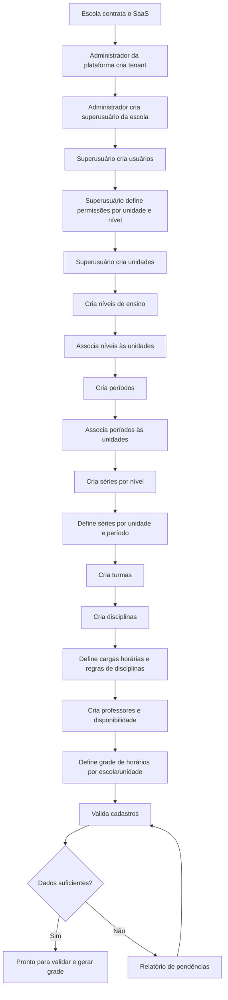
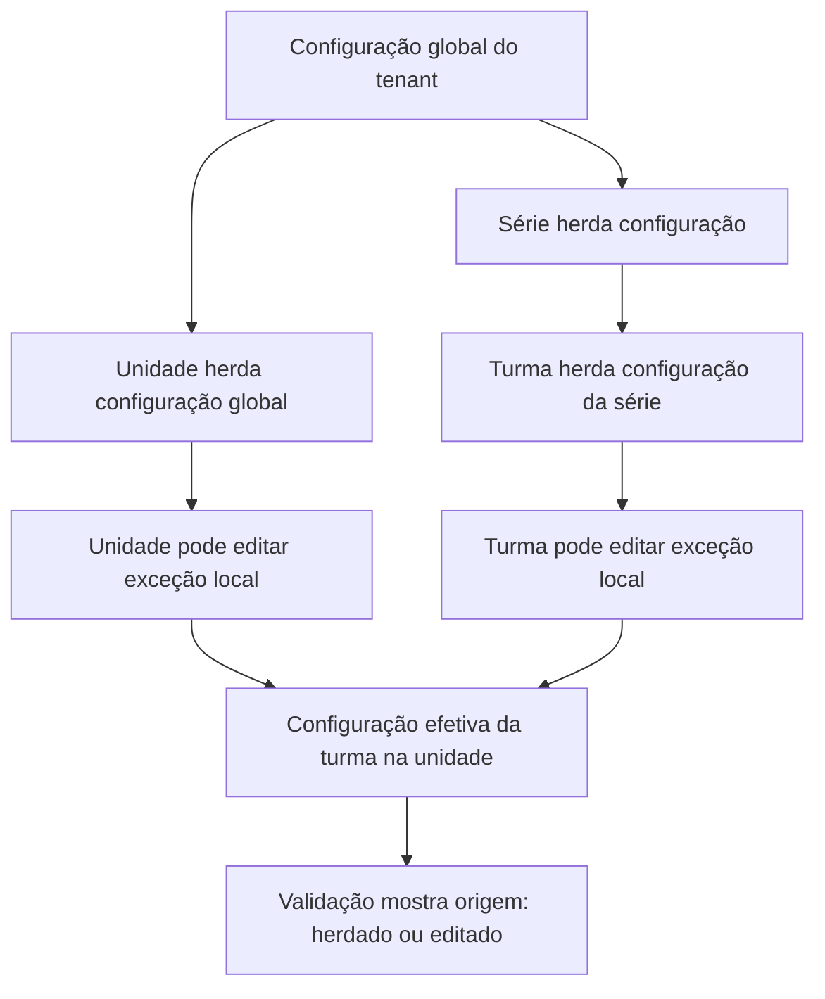

# Grade Certa — PRD (Product Requirements Document)

> **Status:** rascunho revisado de produto  
> **Versão:** 0.4  
> **Fonte principal:** `/opt/data/SmartSchedule/docs/modelagem-entidades-grade-certa.md`  
> **Contexto complementar:** `/opt/data/SmartSchedule/docs/regras-negocio.md`  
> **Escopo deste documento:** produto, regras de negócio, experiência esperada e critérios de valor.  
> **Fora de escopo neste momento:** código, arquitetura técnica, banco de dados, framework, endpoints, telas finais e algoritmo específico.

---

## 1. Visão do Produto

O **Grade Certa** é um SaaS multi-tenant para escolas e redes educacionais configurarem, validarem e gerarem grades horárias escolares complexas.

O produto nasce de uma dor concreta: a montagem manual de grades escolares se torna difícil e propensa a erro quando há múltiplas unidades, níveis de ensino, períodos, turmas, disciplinas, professores, disponibilidades restritas, regras pedagógicas, aulas duplas, aulas paralelas e conflitos de deslocamento.

O produto não deve ser apenas um “gerador de grade”. Ele deve ser uma plataforma de gestão da lógica da grade escolar:

- cadastrar a estrutura da escola;
- explicitar regras e restrições;
- validar se os dados estão completos;
- apontar inconsistências;
- permitir herança e edição local de configurações;
- apoiar a criação ou revisão de grades;
- explicar por que uma solução é ou não possível.

---

## 2. Problema

Hoje, a montagem de uma grade escolar costuma depender de conhecimento tácito, planilhas e ajustes manuais. Esse processo é frágil porque:

- regras ficam espalhadas em conversas, planilhas ou memória de coordenadores;
- cada unidade pode ter horários, turmas e períodos próprios;
- professores podem atuar em várias unidades, séries, níveis e disciplinas;
- uma disciplina pode ter carga horária diferente por série, turma ou unidade;
- algumas aulas precisam ser duplas, outras não podem ser duplas;
- algumas disciplinas podem dividir o mesmo horário com outras;
- alguns professores têm disponibilidade limitada;
- usuários diferentes precisam editar apenas partes do cadastro;
- é difícil saber se uma grade ruim é culpa do algoritmo, dos dados incompletos ou de uma regra impossível.

---

## 3. Objetivos do Produto

### 3.1 Objetivos principais

1. Permitir que uma escola ou rede cadastre sua estrutura acadêmica e operacional.
2. Permitir gestão multiunidade, com herança de configurações e exceções locais.
3. Permitir cadastro de usuários com permissões por unidade e nível de ensino.
4. Permitir modelagem de níveis, períodos, séries, turmas, disciplinas, professores e cargas horárias.
5. Permitir que configurações globais sejam herdadas por séries, turmas e unidades, com possibilidade de edição controlada.
6. Permitir visualização clara de todas as entidades cadastradas.
7. Validar dados antes de qualquer tentativa de geração ou otimização de grade.
8. Explicar conflitos, lacunas e decisões.

### 3.2 Objetivos de médio prazo

1. Validar uma grade humana já existente a partir dos cadastros do sistema.
2. Gerar sugestões de grade a partir das regras cadastradas.
3. Comparar cenários e versões de grade.
4. Apontar o que precisa mudar para uma grade se tornar viável.
5. Importação de planilhas fica para uma fase futura, fora do MVP.

---

## 4. Não objetivos neste momento

Neste ciclo de descoberta, o produto **não** deve definir:

- linguagem de programação;
- framework;
- banco de dados;
- endpoints;
- estrutura de arquivos;
- algoritmo específico de otimização;
- telas finais;
- layout visual definitivo.

O foco é entender o domínio, regras de negócio, papéis, fluxos e decisões de produto.

---

## 5. Personas e Papéis

### 5.1 Administrador da Plataforma

Representa a equipe dona do SaaS.

Responsabilidades:

- criar o tenant da escola;
- criar o primeiro superusuário da escola;
- acompanhar status da escola cliente;
- apoiar configuração inicial quando necessário.

### 5.2 Superusuário da Escola

Usuário principal dentro do tenant.

Responsabilidades:

- criar usuários da escola;
- criar unidades;
- criar níveis de ensino;
- criar períodos;
- criar séries;
- criar disciplinas;
- criar professores;
- configurar regras globais;
- decidir o que pode ser herdado ou editado por unidade;
- visualizar todas as entidades do tenant.

### 5.3 Usuário de Unidade

Usuário com permissão em uma ou mais unidades.

Responsabilidades possíveis:

- editar níveis disponíveis em sua unidade;
- editar períodos da unidade;
- configurar séries e turmas da unidade;
- ajustar cargas horárias herdadas quando autorizado;
- consultar entidades relacionadas à sua unidade.

### 5.4 Usuário por Nível de Ensino

Usuário com permissão em um ou mais níveis de ensino.

Responsabilidades possíveis:

- configurar dados pedagógicos do nível;
- revisar séries associadas;
- revisar disciplinas e cargas horárias;
- apoiar validação de regras curriculares.

### 5.5 Visualizador

Usuário que consulta informações, mas não edita.

Responsabilidades:

- ler cadastros;
- consultar grades;
- consultar relatórios;
- acompanhar conflitos.

---

## 6. Princípios de Produto

1. **Tudo pertence a um tenant.** Nenhum dado escolar deve existir solto fora da escola/rede cliente.
2. **Todos os identificadores devem ser UUIDs.** Se qualquer entidade for modelada futuramente, seu identificador deve ser UUID.
3. **Herança deve ser explícita.** Quando uma configuração vem da escola, série ou unidade, o usuário precisa saber de onde ela veio.
4. **Exceções locais são parte do domínio.** Uma unidade ou turma pode precisar alterar uma regra herdada.
5. **Permissões devem refletir responsabilidade real.** Usuários podem ter acesso por unidade, por nível de ensino ou ambos.
6. **Não confundir período, turno e turma.** Manhã/tarde/noite/integral são configurações da operação da unidade, não parte fixa do nome da turma.
7. **Validação vem antes da geração.** O sistema deve detectar ausência de dados e regras impossíveis antes de prometer uma grade.
8. **Explicabilidade é requisito central.** O sistema deve explicar conflitos e decisões.
9. **O produto deve começar simples e crescer em complexidade.** Uma escola pequena não deve ser obrigada a preencher regras de rede grande.
10. **O sistema deve mostrar as entidades ao usuário.** Cada entidade importante precisa ser visível, pesquisável e compreensível.

---

## 7. Escopo funcional inicial

### 7.1 Gestão de tenant e escola

O produto deve permitir que o administrador da plataforma crie um tenant para uma escola ou rede.

Requisitos:

- criar tenant com nome da escola/rede;
- criar superusuário inicial com email, nome e sobrenome;
- associar todos os cadastros posteriores ao tenant;
- impedir acesso entre tenants.

### 7.2 Gestão de usuários e permissões

O superusuário deve poder criar usuários com:

- email;
- nome;
- sobrenome;
- permissões por unidade;
- permissões por nível de ensino.

Requisitos:

- permitir selecionar uma ou várias unidades;
- permitir botão “selecionar todas” para unidades;
- permitir selecionar um ou vários níveis de ensino;
- permitir botão “selecionar todos” para níveis;
- permitir que um usuário tenha acesso amplo ou restrito;
- refletir permissões nas entidades que o usuário pode ver ou editar.

### 7.3 Gestão de unidades

O superusuário deve poder criar uma ou mais unidades da escola.

Requisitos:

- unidade pertence a um tenant;
- unidade pode ter níveis de ensino associados;
- unidade pode ter períodos associados;
- unidade pode ter séries e turmas;
- usuários autorizados à unidade podem editar dados locais permitidos.

### 7.4 Gestão de níveis de ensino

O superusuário deve criar níveis como:

- Fundamental Anos Iniciais;
- Fundamental Anos Finais;
- Ensino Médio;
- outros níveis personalizados.

Requisitos:

- níveis pertencem ao tenant;
- níveis podem ser associados a unidades;
- usuários podem ter permissão por nível;
- níveis agrupam séries.

### 7.5 Gestão de períodos

O superusuário deve criar períodos, como:

- manhã;
- tarde;
- noite;
- integral (composição de blocos/turnos);
- contraturno;
- personalizado.

Requisitos:

- períodos pertencem ao tenant;
- períodos podem ser associados a unidades;
- uma unidade pode ter mais de um período;
- em nosso estudo de caso, manhã e tarde são períodos distintos, com populações de alunos distintas, mas com a mesma quantidade total de aulas na semana;
- usuários da unidade podem editar períodos quando autorizados.
- período integral deve ser representado como composição de blocos/turnos, porque uma jornada integral precisa explicitar manhã, almoço e tarde em vez de virar um período único opaco.

### 7.6 Gestão de séries

O superusuário deve criar séries atreladas a níveis de ensino.

Exemplos:

- 1º ano;
- 2º ano;
- 6º ano;
- 1ª série do Ensino Médio.

Requisitos:

- série pertence a um nível;
- série pode ser disponibilizada para uma ou várias unidades;
- série pode existir em períodos específicos dentro da unidade;
- deve ser possível criar configuração para todas as unidades de uma vez;
- unidades podem editar sua configuração local quando necessário.

### 7.7 Gestão de turmas

O superusuário e usuários de unidade devem criar turmas por série, unidade e período.

Exemplos:

- 6º ano A;
- 6º ano B;
- 6º T;
- 1ª série EM M1.

Requisitos:

- turma pertence a uma unidade;
- turma pertence a uma série;
- turma está associada a um período;
- turma pode ter código/nome local;
- turma herda configurações da série e da escola quando aplicável;
- turma pode receber exceções locais.

### 7.8 Gestão de disciplinas

O superusuário deve criar disciplinas ministradas pela escola.

Requisitos:

- disciplina pertence ao tenant;
- disciplina pode ter nome e código interno único;
- cada disciplina deve ter, no máximo, um código local;
- se duas variações precisarem de códigos diferentes, elas devem ser modeladas como disciplinas distintas;
- exemplo: `Ciências` e `Ciências (laboratório)` não compartilham o mesmo código;
- disciplina pode estar associada a níveis e séries;
- disciplina pode ter regras de aula dupla, compartilhamento de horário e carga horária;
- disciplina deve poder ser atribuída a turmas.

### 7.9 Carga horária por disciplina

Cada disciplina em cada turma deve ter carga horária semanal.

Importante:

- quantidade de aulas por semana é diferente de duração da aula;
- a modelagem precisa separar `weekly_lessons` de `lesson_duration_min`.

O fluxo ideal de herança é:

1. escola define uma carga padrão;
2. séries herdam a carga padrão;
3. turmas herdam a carga da série;
4. unidades e turmas podem editar quando necessário.

Requisitos:

- permitir definir carga por escola/tenant;
- permitir definir carga por série;
- permitir que turmas herdem automaticamente;
- permitir exceções por unidade;
- permitir exceções por turma;
- deixar claro se a carga é herdada ou local;
- validar se a soma de cargas cabe nos slots disponíveis.

### 7.10 Gestão de professores

O superusuário deve criar professores.

Professores devem ter:

- nome;
- email;
- disciplinas que podem lecionar;
- unidades em que podem lecionar;
- níveis que podem lecionar;
- séries que podem lecionar;
- disponibilidade;
- número máximo de janelas na semana;
- outras restrições e preferências.

Requisitos:

- professor pode lecionar várias disciplinas;
- professor pode atuar em várias unidades;
- professor pode atuar em vários níveis e séries;
- disponibilidade deve ser granular por dias da semana e horários/slots;
- horários não informados pelo professor devem ser tratados como indisponíveis por padrão;
- janelas devem ser tratadas como restrição flexível, ajustável pela política da escola.

### 7.11 Grade horária da unidade

Cada unidade deve ter sua grade de horários com início e fim de cada aula.

Requisitos:

- permitir criar uma grade de horários padrão da escola;
- unidades herdam a grade padrão;
- unidades podem editar horários locais;
- horários devem suportar períodos diferentes;
- horários devem suportar 5, 6 ou outro número de aulas por dia;
- horários devem suportar integral, almoço, intervalo e contraturno;
- slots precisam ser explicitados; qualquer vazio na grade final indica que a grade ainda não está pronta.

### 7.12 Regras de disciplinas no horário

Disciplinas podem ter regras específicas:

- dividir horário com outra disciplina quando isso representar divisão de turma em grupos e revezamento semanal;
- exigir dobradinha;
- permitir dobradinha;
- proibir dobradinha;
- preferir determinada distribuição semanal.

Requisitos:

- permitir marcar aula dupla obrigatória;
- permitir marcar aula dupla proibida;
- permitir marcar aula dupla opcional;
- permitir indicar disciplinas que podem acontecer simultaneamente;
- permitir modelar divisão de turma/subgrupos quando necessário;
- considerar que uma aula composta ocupa um único slot da turma;
- máximo de duas aulas da mesma disciplina no mesmo dia;
- validar impacto na carga horária da turma e dos professores.

### 7.13 Ano letivo e ciclo de planejamento

A configuração da escola deve estar vinculada a um ano letivo ou ciclo de planejamento.

Requisitos:

- permitir identificar o ano/ciclo para o qual a grade está sendo montada;
- permitir que turmas, matrizes curriculares, disponibilidades e versões de grade mudem de um ano para outro;
- permitir consultar grades antigas sem misturar com o ciclo atual;
- permitir que uma escola prepare a grade do próximo ano enquanto mantém a grade atual publicada.

### 7.14 Matriz curricular

A matriz curricular deve ser tratada como o agrupamento das disciplinas e cargas horárias esperadas para uma série, unidade ou turma em determinado ano/ciclo.

Requisitos:

- permitir matriz padrão da escola;
- permitir matriz por nível/série;
- permitir exceção por unidade;
- permitir exceção por turma;
- deixar claro quando uma carga foi herdada da matriz e quando foi editada localmente.

### 7.15 Espaços físicos

Fora de escopo desta versão do produto.

O Grade Certa não precisa modelar espaço físico para entregar a primeira versão focada em cadastro, validação e geração.

### 7.16 Importação e validação de planilhas existentes

Importação de planilhas fica fora do MVP. Se isso voltar a entrar no roadmap, deverá ser tratada como uma extensão futura do produto, com fluxo próprio de revisão e validação humana.

---

## 8. Fluxo principal do produto

---

## 9. Fluxo de herança e exceções

---

## 10. Critérios de sucesso

O produto será bem-sucedido na primeira fase se permitir que uma escola:

- crie tenant e superusuário;
- cadastre unidades;
- cadastre usuários com permissões por unidade e nível;
- cadastre níveis, períodos, séries e turmas;
- cadastre disciplinas;
- defina cargas horárias com herança e exceção;
- cadastre professores com habilitações e disponibilidade;
- defina horários por escola e unidade;
- visualize todas as entidades;
- receba diagnóstico de dados faltantes e conflitos básicos.

Critérios verificáveis iniciais:

- dada uma turma sem carga horária completa, o sistema deve indicar a turma, a disciplina faltante e a ação recomendada;
- dado um professor sem disponibilidade cadastrada, o sistema deve impedir o status “pronto para grade” até que a pendência seja resolvida ou justificada;
- dada uma disciplina sem professor habilitado, o sistema deve apontar a disciplina, as turmas afetadas e o escopo do problema;
- dada uma carga horária maior que os slots disponíveis, o sistema deve identificar a incompatibilidade antes de qualquer geração;
- dada uma regra herdada editada localmente, o sistema deve mostrar o valor original, o valor local e o escopo da exceção.

---

## 11. Métricas de produto sugeridas

### 11.1 Métricas de configuração

- percentual de entidades obrigatórias cadastradas;
- número de pendências por unidade;
- número de turmas sem carga horária completa;
- número de disciplinas sem professor habilitado;
- número de professores sem disponibilidade.

### 11.2 Métricas de qualidade da grade

- conflitos rígidos encontrados;
- restrições flexíveis violadas;
- janelas de professor;
- aulas fora da preferência;
- carga horária não alocada;
- uso de exceções locais.

### 11.3 Métricas de adoção

- unidades configuradas;
- usuários ativos;
- cadastros concluídos por período letivo;
- grades geradas ou validadas;
- relatórios de conflito resolvidos.

---

## 12. Riscos de produto

1. **Complexidade excessiva no cadastro inicial.** Escolas pequenas podem desistir se o produto exigir configuração de rede grande.
2. **Herança confusa.** Usuário pode não entender se uma regra veio da escola, série, unidade ou turma.
3. **Permissões mal definidas.** Usuários locais podem editar dados globais indevidamente ou ficar bloqueados demais.
4. **Regras pedagógicas ambíguas.** Termos como “dobradinha”, “dividir horário” e “janela” precisam ser definidos com precisão.
5. **Prometer geração antes de validação.** O produto deve primeiro mostrar se os dados tornam a grade possível.
6. **Planilhas legadas com estrutura irregular.** Se a importação voltar ao roadmap, ela exigirá validação e revisão humana.

---

## 13. Decisões consolidadas da versão 0.3

1. Permissão por unidade e permissão por nível se combinam por **interseção**.
2. Exceções locais **não precisam de aprovação adicional**; a mudança segue o escopo de permissão do usuário.
3. **Período integral** será representado como **composição de blocos/turnos**, porque isso descreve melhor uma jornada com manhã, almoço e tarde do que um período único opaco.
4. **Dobradinha obrigatória** deve acontecer sempre em **slots consecutivos no mesmo dia**.
5. Quando uma disciplina divide horário com outra, isso deve ser tratado como **divisão de turma em grupos que revezam semanalmente**; a preocupação central continua sendo o **professor + subgrupo**, não uma alternância pedagógica separada.
6. O número de janelas do professor é uma **restrição flexível**.
7. **Aula composta conta uma vez para a turma**; os componentes contam individualmente para os professores envolvidos.
8. Usuário de unidade **pode alterar a carga herdada**.
9. Uma unidade **pode ter séries em períodos diferentes simultaneamente**; a turma continua vinculada ao seu período específico.
10. **Slot vazio não é permitido** na grade final; se existir vazio, a grade ainda não está pronta.

---

## 14. Recomendação de escopo inicial

A primeira versão conceitual deveria focar em **cadastro estruturado + validação + geração assistida**, não em importação.

Sequência recomendada:

1. tenant e usuários;
2. unidades, níveis e períodos;
3. séries e turmas;
4. disciplinas e cargas horárias com herança;
5. professores e disponibilidade;
6. horários/slots por unidade;
7. validação de dados mínimos;
8. geração da grade;
9. relatório de pendências e conflitos;
10. importação/validação de grade existente apenas em fase futura.

