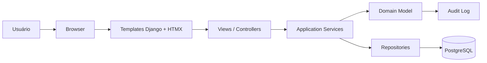

# Grade Certa — SDD de Arquitetura do Sistema

> **Status:** rascunho de arquitetura  
> **Versão:** 0.3  
> **Base conceitual:** `/opt/data/SmartSchedule/docs/modelagem-entidades-grade-certa.md`, PRD/SDD do Grade Certa e padrão de implementação do Thinkflow  
> **Escopo deste documento:** arquitetura do sistema, stack, organização do código, containers, camadas DDD, estratégia de testes e front-end server-side.  
> **Fora de escopo neste momento:** estilo visual, identidade visual, design system, branding e detalhamento de UI final.

---

## 1. Objetivo deste documento

Este documento descreve a estrutura técnica proposta para o Grade Certa.

A intenção é deixar claro:

- qual stack será usada;
- como o sistema será containerizado;
- como o domínio será organizado em DDD;
- como o front-end será servido;
- como a persistência funcionará;
- como os testes devem ser estruturados;
- quais decisões arquiteturais já estão assumidas.

Este documento não define telas finais nem visual.

---

## 2. Decisões de base

### 2.1 Stack principal

A arquitetura deve seguir estas escolhas:

- **Backend:** Django;
- **Banco de dados:** PostgreSQL;
- **Containerização:** Docker e Docker Compose;
- **Camada de interface:** Django Template Language (DTL);
- **Interatividade incremental:** HTMX;
- **Auditoria:** `django-auditlog`;
- **Base de projeto / padrão de arranque:** `django-base-kit`;
- **Gerenciamento de dependências:** Poetry;
- **Verificação dev:** Ruff;
- **Arquitetura de código:** DDD;
- **Testes:** cobertura robusta de testes unitários e de integração leve.

### 2.2 Princípios arquiteturais

1. **Server-side first.**
   O sistema será renderizado no servidor com templates Django.

2. **HTMX como extensão, não como substituição do frontend.**
   HTMX deve melhorar a experiência sem transformar o sistema em SPA.

3. **DDD como estrutura de organização.**
   O domínio deve ser separado da infraestrutura e da apresentação.

4. **PostgreSQL como fonte principal de verdade.**
   O banco relacional será a base do produto.

5. **Docker como padrão operacional.**
   O projeto deve rodar de forma consistente em dev, teste e produção.

6. **Testes primeiro para regras críticas.**
   Regras do domínio e serviços de aplicação precisam de cobertura forte.

7. **Visual adiado.**
   Nesta versão não há decisão de estilo visual, branding ou identidade final.

---

## 3. Visão geral da arquitetura

### 3.1 Fluxo de alto nível



### 3.2 Leitura do diagrama

- O navegador acessa páginas Django tradicionais.
- As páginas usam HTMX para fragmentos e atualizações parciais.
- As views chamam serviços da camada de aplicação.
- A lógica de negócio vive no domínio, não nas views.
- A persistência é feita por repositórios/adapters.
- Auditoria registra mudanças relevantes de entidades e operações.

---

## 4. Padrão de implementação do projeto

### 4.1 Ponto de partida

O projeto deve usar o **Thinkflow como referência de padrão** para:

- organização de imagens Docker;
- composição de `docker-compose`;
- separação entre ambiente de desenvolvimento e ambiente de execução;
- estratégia de entrypoint;
- convenções de build;
- forma de expor serviços e variáveis de ambiente;
- uso de healthcheck e dependências entre containers.

Na dúvida, a regra é seguir o padrão do Thinkflow.

### 4.2 Base reutilizável

O projeto deve aproveitar:

- `django-base-kit` como base estrutural inicial;
- `django-auditlog` para trilha de auditoria;
- Django nativo para auth, templates, forms, URLs e views;
- Poetry para gerenciamento de dependências, ambientes e comandos do projeto;
- Ruff como verificador principal de qualidade em desenvolvimento.

### 4.3 Multi-tenancy com `django-tenants`

O sistema deve ser multi-tenant por schema usando `django-tenants`.

Decisões principais:

- cada instituição/cliente opera em um schema próprio;
- o schema `public` concentra o que é compartilhado;
- o tenant é resolvido pelo domínio/acesso;
- o isolamento de dados é garantido no nível de schema;
- migrações devem respeitar a separação entre shared apps e tenant apps;
- comandos administrativos e testes precisam suportar troca explícita de schema.

Configuração esperada:

- `SHARED_APPS` para apps globais e infra comum;
- `TENANT_APPS` para os apps que vivem dentro de cada tenant;
- `TenantMixin` e `DomainMixin` para os modelos base de tenant e domínio;
- uso de `migrate_schemas --shared` para a inicialização do schema público;
- uso de `schema_context()` e `tenant_context()` quando for necessário executar lógica em um schema específico.

Na dúvida, seguir a documentação oficial de `django-tenants` e o padrão do Thinkflow para a organização operacional do projeto.

Essa combinação deve servir como fundação, sem impedir a evolução para a arquitetura própria do Grade Certa.

---

## 5. Organização em DDD

### 5.1 Objetivo do DDD no projeto

O uso de DDD aqui tem uma finalidade prática:

- separar o vocabulário do negócio da implementação técnica;
- evitar views gordas e modelos anêmicos;
- isolar regras de grade, herança e validação;
- facilitar testes unitários de regras críticas;
- manter o sistema evolutivo sem virar um emaranhado de lógica em templates ou views.

### 5.2 Camadas

A aplicação deve ser organizada em camadas conceituais.

Importante: essas camadas são uma *separação lógica*, não necessariamente uma árvore de diretórios separada no topo do projeto. Na prática, cada app de domínio pode conter sua própria aplicação, domínio e adapters internos, desde que a fronteira fique clara.

#### a) Domain

Contém o coração do negócio:

- entidades;
- value objects;
- regras invariantes;
- políticas de domínio;
- eventos de domínio, quando necessários;
- interfaces conceituais de repositório.

Regras:

- sem dependência de Django ORM;
- sem dependência de HTTP;
- sem dependência de templates;
- sem lógica de apresentação.

#### b) Application

Contém orquestração de caso de uso:

- comandos;
- consultas;
- serviços de aplicação;
- transações;
- coordenação entre domínio e infraestrutura.

Regras:

- pode depender do domínio;
- não deve conter regra de negócio pura que pertença ao domínio;
- coordena persistência, validação e autorização de fluxo.

#### c) Infrastructure

Contém detalhes técnicos:

- modelos Django/ORM;
- repositórios concretos;
- integrações;
- auditoria;
- adapters;
- serviços de suporte;
- storage e serialização.

#### d) Presentation

Contém a camada web:

- views;
- forms;
- templates;
- partials HTMX;
- URLs;
- mixins de autorização;
- tratamento de request/response.

### 5.3 Regra de fronteira

A regra geral é:

- **domain não conhece Django**;
- **application conhece domain**;
- **infrastructure conhece domain e application**;
- **presentation conhece application**.

### 5.4 Domínios sugeridos a partir da modelagem

- `tenants`: tenant, resolução e governança;
- `accounts`: usuário, papel e atribuição de papel;
- `schools`: unidade, período, série, turma e ano letivo;
- `curriculum`: disciplina, matriz curricular, carga horária e regras;
- `people`: professor, habilitação e disponibilidade;
- `scheduling`: grade, versão de grade, slots, aula alocada, componente, conflito e validação.

---

## 6. Estrutura sugerida do projeto

A estrutura deve seguir o padrão Thinkflow: *cada domínio principal vira um app Django próprio*, com seus arquivos usuais de modelo, views, urls, forms, admin e testes.

Exemplo:

```text
smartschedule/
├─ config/                    # settings, urls, wsgi, asgi
├─ apps/
│  ├─ tenants/                # public schema: tenant/domain model, resolução e governança
│  ├─ accounts/               # autenticação, permissões, perfis, papéis
│  ├─ schools/                # unidades, períodos, séries, turmas
│  ├─ curriculum/             # disciplinas, matrizes, cargas, herança
│  ├─ people/                 # professores, habilitações, disponibilidade
│  ├─ scheduling/             # grade, slots, aulas, conflitos, validações
│  └─ imports/                # extensão futura fora do MVP (planilhas)
├─ templates/
│  ├─ base/
│  └─ apps/
├─ static/
├─ locale/
├─ tests/
└─ manage.py
```

### 6.1 Estrutura interna de cada app

Cada app de domínio deve manter uma organização previsível, por exemplo:

```text
apps/scheduling/
├─ admin.py
├─ apps.py
├─ forms.py
├─ models.py
├─ selectors.py
├─ services.py
├─ urls.py
├─ views.py
├─ templates/
│  └─ scheduling/
└─ tests/
   ├─ test_models.py
   ├─ test_views.py
   ├─ test_services.py
   └─ test_selectors.py
```

Essa organização pode variar conforme o tamanho do domínio, mas a regra geral é manter tudo do mesmo contexto no mesmo app, sem espalhar entidades do mesmo domínio em módulos globais soltos.

### 6.2 Auditoria por domínio

Não haverá um app separado de audit no código-base.

O `django-auditlog` deve ser aplicado diretamente nos modelos de cada domínio que precise de trilha de mudanças, com registro explícito das entidades relevantes dentro dos próprios apps.

Na prática:

- cada app registra seus próprios modelos auditáveis;
- a trilha de auditoria fica próxima do domínio;
- a preocupação com histórico não vira um bounded context isolado sem necessidade.

### 6.3 Observações sobre a estrutura

- O domínio não deve ficar dividido em uma árvore separada de `domain/`, `application/` e `infrastructure/` se isso atrapalhar a leitura do projeto.
- A separação DDD continua válida conceitualmente, mas sua expressão prática fica dentro de cada app.
- Se um contexto crescer demais, ele pode ser subdividido em apps menores sem quebrar a lógica do domínio.
- Os nomes dos módulos internos devem ser em inglês; os textos do produto podem ser em português.

---

## 7. Bounded contexts iniciais

A primeira divisão de domínio pode seguir os contextos abaixo:

### 7.1 Accounts / Acesso

Responsável por:

- autenticação;
- autorização;
- papéis;
- permissões por unidade e nível;
- gestão de usuários.

### 7.2 Tenancy / Governança

Responsável por:

- tenant;
- isolamento de dados;
- configurações globais;
- contexto institucional.

### 7.3 Estrutura escolar

Responsável por:

- unidades;
- níveis;
- períodos;
- séries;
- turmas.

### 7.4 Currículo

Responsável por:

- disciplinas;
- códigos locais;
- matrizes curriculares;
- cargas horárias;
- herança e exceções.

### 7.5 Pessoas

Responsável por:

- professores;
- habilitações;
- unidades permitidas;
- níveis permitidos;
- séries permitidas;
- disponibilidade;
- janelas.

### 7.6 Scheduling

Responsável por:

- grade de horários;
- slots;
- aulas alocadas;
- componentes de aula;
- conflitos;
- validação da grade.

### 7.7 Importação (fora do MVP)

Esta capacidade fica fora do MVP. Se for retomada em uma fase futura, poderá viver em um app/contexto próprio de integração.

Responsável por:

- leitura de planilhas;
- mapeamento;
- validação;
- criação de versões provisórias;
- relatórios de inconsistência.

---

## 8. Persistência e banco de dados

### 8.1 Banco

- PostgreSQL será o banco principal.
- O modelo relacional deve suportar integridade, índices e consultas administrativas.
- UUID deve ser o padrão para identificação.

### 8.2 ORM

- Django ORM será usado como camada de persistência principal.
- O ORM não deve receber regra de negócio que pertença ao domínio puro.
- Querysets complexos devem ficar encapsulados em repositórios, managers especializados ou services de leitura.

### 8.3 BaseModel e herança

Todos os models de domínio do Grade Certa que não herdam de mixins específicos (`TenantMixin`, `DomainMixin`) devem herdar de `BaseModel` do `django-base-kit`.

O `BaseModel` fornece:

| Campo | Tipo | Descrição |
|-------|------|-----------|
| `id` | UUID | Chave primária, gerada automaticamente |
| `created_at` | DateTime | Timestamp de criação (auto_now_add) |
| `updated_at` | DateTime | Timestamp de atualização (auto_now) |
| `active` | Boolean | Ativação/desativação lógica (default=True) |
| `changelog` | AuditlogHistoryField | Auditoria automática de mudanças |

Isso elimina a necessidade de declarar manualmente `id`, `created_at`, `updated_at`, `active` e `changelog` em cada model. Modelos que usam `BaseModel` não devem declarar esses campos novamente.

Exceções:

- `Tenant` e `Domain` herdam de `TenantMixin`/`DomainMixin` do `django-tenants` e não usam `BaseModel`.
- O model `User` herda de `BaseModel` + `AbstractUser` (via herança combinada) e customiza `USERNAME_FIELD` e reverse accessors.

### 8.4 Migrações

- Toda alteração estrutural deve passar por migração Django.
- O projeto deve tratar migrações como parte da disciplina arquitetural, não como detalhe secundário.

---

## 9. Front-end com Django + HTMX

### 9.1 Diretriz geral

O front deve ser feito com:

- Django Template Language;
- partials reutilizáveis;
- HTMX para atualizações incrementais;
- mínima dependência de JavaScript manual.

### 9.2 O que HTMX deve resolver

HTMX pode ser usado para:

- salvar formulários sem recarregar a página inteira;
- atualizar listas e painéis parciais;
- abrir modais ou painéis laterais;
- trocar tabelas, linhas ou filtros dinamicamente;
- mostrar feedbacks e validações inline.

### 9.3 O que evitar

- virar uma SPA improvisada;
- duplicar lógica em JavaScript e servidor;
- esconder regra de negócio em eventos de front;
- acoplar comportamento visual ao domínio.

### 9.4 Estrutura de templates

- templates base;
- partials por contexto;
- componentes reutilizáveis via includes;
- páginas completas e fragmentos HTMX bem separados.

---

## 10. `django-base-kit` como base

O projeto deve usar o `django-base-kit` como base padrão quando fizer sentido para acelerar:

- autenticação;
- layout estrutural inicial;
- forms de conta;
- convenções de arranque;
- organização inicial do projeto.

### 10.1 Princípio de uso

- reutilizar o que for sólido;
- sobrescrever o que for necessário para o domínio do Grade Certa;
- não depender da base como se ela fosse o produto final.

### 10.2 BaseModel do django-base-kit

O `django-base-kit` fornece um `BaseModel` abstrato que deve ser herdado por todos os models de domínio do Grade Certa que precisem de:

- `id` — UUID como chave primária;
- `created_at` — timestamp de criação (auto_now_add);
- `updated_at` — timestamp de atualização (auto_now);
- `active` — booleano para ativação/desativação lógica (default=True);
- `changelog` — campo de auditoria do `django-auditlog` (AuditlogHistoryField).

Modelos que já herdam de mixins específicos (como `TenantMixin` e `DomainMixin` do `django-tenants`) não precisam herdar de `BaseModel`, pois esses mixins já gerenciam o ciclo de vida do tenant. No entanto, todos os models de domínio próprios do Grade Certa (unidade, nível, período, série, turma, disciplina, professor, grade, slot, etc.) devem herdar de `BaseModel`.

Para o model `User`, o `django-base-kit` fornece `User(BaseModel, AbstractUser)` com `email` único. O Grade Certa deve herdar desse User ou herdar diretamente de `BaseModel` + `AbstractUser` quando precisarcustomizar `USERNAME_FIELD` e reverse accessors.

### 10.3 Expectativa arquitetural

A base deve servir como fundação, mas a arquitetura final do Grade Certa deve ser própria e orientada ao domínio do scheduling escolar.

---

## 11. Auditoria com `django-auditlog`

O `django-auditlog` deve ser usado diretamente nos modelos dos domínios relevantes.

A auditoria deve registrar mudanças relevantes em entidades críticas, sem existir um app audit dedicado.

Entidades prioritárias para auditoria, a partir da modelagem: tenant, unidade, período, série, turma, disciplina, matriz curricular, item de carga horária, professor, habilitação, disponibilidade, grade, versão de grade, slot, aula alocada, componente de aula, validação e conflito.

### 11.1 Entidades candidatas à auditoria

- usuário;
- tenant;
- unidade;
- nível;
- período;
- série;
- turma;
- disciplina;
- matriz curricular;
- item de carga horária;
- professor;
- habilitação;
- disponibilidade;
- grade;
- versão de grade;
- slot;
- aula alocada;
- componente de aula;
- validação;
- conflito.

### 11.2 Objetivo da auditoria

- rastrear alterações sensíveis;
- saber quem alterou e quando;
- apoiar troubleshooting e governança;
- melhorar confiança do usuário no sistema.

### 11.3 Regra

A auditoria deve ser útil operacionalmente, não apenas decorativa.

---

## 12. Estratégia de testes

### 12.1 Princípio

A cobertura de testes deve ser robusta, especialmente onde o domínio é sensível.

### 12.2 Pirâmide de testes sugerida

#### a) Testes unitários de domínio

Cobrir:

- regras de herança;
- validação de disciplina;
- disponibilidade de professor;
- conflitos de slot;
- dobradinha;
- múltiplos componentes;
- janelas;
- slot vazio inválido.

#### b) Testes de aplicação

Cobrir:

- comandos de criação/edição;
- fluxos de validação;
- autorização por escopo;
- transações;
- integração com repositórios.

#### c) Testes de apresentação

Cobrir:

- views principais;
- formulários;
- respostas parciais HTMX;
- renderização de templates;
- mensagens de erro e sucesso.

#### d) Testes de integração leve

Cobrir:

- banco PostgreSQL em ambiente de teste;
- auditoria;
- fluxos completos de caso de uso;
- importação e validação básica.

### 12.3 Recomendação de tooling

- `Poetry`;
- `Ruff`;
- `pytest`;
- `pytest-django`;
- factories para massa de dados;
- cobertura mínima reforçada para serviços e domínio.

### 12.4 Regra de qualidade

As regras de negócio críticas não devem existir apenas “testadas por acidente” via view. Elas precisam de testes unitários dedicados.

---

## 13. Dockerização

### 13.1 Objetivo

Tudo deve rodar via Docker de forma previsível.

### 13.2 Serviços mínimos

- `web` — aplicação Django;
- `db` — PostgreSQL;
- `test` — execução de suíte de testes, quando aplicável.

### 13.3 Padrão de imagens

Usar o padrão do Thinkflow para:

- base image;
- build stages;
- organização do Dockerfile;
- entrypoint;
- variáveis de ambiente;
- healthcheck;
- volumes;
- isolamento entre desenvolvimento e execução.

Imagens de referência explicitamente consideradas nesta arquitetura:

- `python:3.13-alpine` como base da imagem Python da aplicação;
- `postgres:18.1-trixie` como imagem do banco PostgreSQL;
- as imagens e convenções de build do Thinkflow como referência operacional para a aplicação.

### 13.4 Diretrizes de Docker

- imagem da aplicação deve ser reproduzível;
- dependências devem ser instaladas de forma previsível;
- ambiente de desenvolvimento não deve depender de instalação manual fora do container;
- PostgreSQL deve subir com volume persistente;
- o container web deve aguardar a disponibilidade do banco quando necessário.

### 13.5 Docker Compose

O `docker-compose` deve separar pelo menos:

- ambiente local de desenvolvimento;
- ambiente de teste;
- ambiente de execução padronizada.

---

## 14. Configuração e ambiente

### 14.1 Configuração por ambiente

O projeto deve usar variáveis de ambiente para:

- `SECRET_KEY`;
- `DEBUG`;
- `ALLOWED_HOSTS`;
- `DATABASE_URL` ou equivalente;
- credenciais de serviços externos, se existirem;
- configurações de auditoria e logging.

### 14.2 Princípio de segurança

- nada sensível deve ficar hardcoded;
- arquivos de exemplo precisam ser seguros para desenvolvimento;
- produção e desenvolvimento devem ser distinguíveis.

---

## 15. Observabilidade e logs

Mesmo sem entrar em infraestrutura avançada, o sistema deve prever:

- logging estruturado o suficiente para depuração;
- auditoria de domínio;
- identificação de falhas de importação e validação;
- rastreabilidade de ações críticas.

---

## 16. Convenções de código

### 16.1 Identificadores

- nomes técnicos em inglês;
- nomes de domínio podem preservar o vocabulário do problema;
- DTOs, services e repositories devem ter nomes explícitos.

### 16.2 Separação de responsabilidade

- views não devem carregar regra de negócio complexa;
- templates não devem decidir regra de grade;
- forms devem validar entrada, não governar o domínio;
- domain services devem concentrar invariantes importantes.

---

## 17. O que não entra nesta fase

Não faz parte deste documento:

- identidade visual;
- sistema de design;
- polimento gráfico;
- tipografia;
- paleta de cores;
- animações;
- decisão sobre biblioteca visual específica.

O foco é arquitetura e estrutura.

---

## 18. Próximos passos sugeridos

1. Consolidar a estrutura de apps e pastas.
2. Definir os bounded contexts com mais precisão.
3. Modelar entidades centrais em domínio e persistência.
4. Montar Dockerfiles e `docker-compose` seguindo o padrão do Thinkflow.
5. Definir a base de testes com `pytest`, `pytest-django`, `Poetry` e `Ruff`.
6. Implementar a primeira fatia funcional com Django + DTL + HTMX.

---

## 19. Critério de sucesso desta arquitetura

Esta arquitetura será considerada boa se permitir:

- evoluir o domínio sem quebrar tudo;
- testar regras críticas com facilidade;
- subir o sistema inteiro com Docker;
- manter o front simples e responsivo com templates + HTMX;
- separar claramente domínio, aplicação, infraestrutura e apresentação;
- registrar alterações relevantes com auditoria;
- suportar a complexidade do Grade Certa sem virar um monólito confuso.

