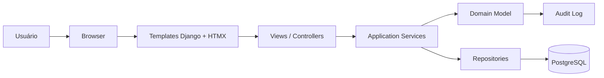

# Grade Certa — SDD de Arquitetura do Sistema

> **Status:** rascunho de arquitetura  
> **Versão:** 0.3  
> **Base conceitual:** `/opt/data/SmartSchedule/docs/modelagem-entidades-grade-certa.md`, PRD/SDD do Grade Certa e padrão de implementação do Thinkflow  
> **Escopo deste documento:** arquitetura do sistema, stack, organização do código, containers, camadas DDD, estratégia de testes e front-end server-side.  
> **Fora de escopo neste momento:** estilo visual, identidade visual, design system, branding e detalhamento de UI final.

---

## 1. Objetivo deste documento

Este documento descreve a estrutura técnica proposta para o Grade Certa.

A intenção é deixar claro:

- qual stack será usada;
- como o sistema será containerizado;
- como o domínio será organizado em DDD;
- como o front-end será servido;
- como a persistência funcionará;
- como os testes devem ser estruturados;
- quais decisões arquiteturais já estão assumidas.

Este documento não define telas finais nem visual.

---

## 2. Decisões de base

### 2.1 Stack principal

A arquitetura deve seguir estas escolhas:

- **Backend:** Django;
- **Banco de dados:** PostgreSQL;
- **Containerização:** Docker e Docker Compose;
- **Camada de interface:** Django Template Language (DTL);
- **Interatividade incremental:** HTMX;
- **Auditoria:** `django-auditlog`;
- **Base de projeto / padrão de arranque:** `django-base-kit`;
- **Gerenciamento de dependências:** Poetry;
- **Verificação dev:** Ruff;
- **Arquitetura de código:** DDD;
- **Task queue / jobs assíncronos:** Celery + Redis (broker);
- **Testes:** cobertura robusta de testes unitários e de integração leve.

### 2.2 Princípios arquiteturais

1. **Server-side first.**
   O sistema será renderizado no servidor com templates Django.

2. **HTMX como extensão, não como substituição do frontend.**
   HTMX deve melhorar a experiência sem transformar o sistema em SPA.

3. **DDD como estrutura de organização.**
   O domínio deve ser separado da infraestrutura e da apresentação.

4. **PostgreSQL como fonte principal de verdade.**
   O banco relacional será a base do produto.

5. **Docker como padrão operacional.**
   O projeto deve rodar de forma consistente em dev, teste e produção.

6. **Testes primeiro para regras críticas.**
   Regras do domínio e serviços de aplicação precisam de cobertura forte.

7. **Visual adiado.**
   Nesta versão não há decisão de estilo visual, branding ou identidade final.

8. **Jobs longos não bloqueiam requests.**
   Processos com tempo de execução potencialmente alto (geração de grade, importação de planilha, exportação pesada) devem rodar como **tasks Celery**, não no request/response do Django. A interface do usuário deve ser assíncrona — dispara a task, mostra progresso, exibe resultado quando pronto.

9. **Orçamento de tempo do solver.**
   O job de **geração automática da grade horária** pode demorar **até 30 minutos** por tenant. Esse é um requisito de produto, não de otimização — usabilidade aceitável do coordenador depende de a UI permitir "agendar para rodar de madrugada" ou "iniciar e voltar depois".

---

## 3. Visão geral da arquitetura

### 3.1 Fluxo de alto nível



### 3.2 Leitura do diagrama

- O navegador acessa páginas Django tradicionais.
- As páginas usam HTMX para fragmentos e atualizações parciais.
- As views chamam serviços da camada de aplicação.
- A lógica de negócio vive no domínio, não nas views.
- A persistência é feita por repositórios/adapters.
- Auditoria registra mudanças relevantes de entidades e operações.

---

## 4. Padrão de implementação do projeto

### 4.1 Ponto de partida

O projeto deve usar o **Thinkflow como referência de padrão** para:

- organização de imagens Docker;
- composição de `docker-compose`;
- separação entre ambiente de desenvolvimento e ambiente de execução;
- estratégia de entrypoint;
- convenções de build;
- forma de expor serviços e variáveis de ambiente;
- uso de healthcheck e dependências entre containers.

Na dúvida, a regra é seguir o padrão do Thinkflow.

### 4.2 Base reutilizável

O projeto deve aproveitar:

- `django-base-kit` como base estrutural inicial;
- `django-auditlog` para trilha de auditoria;
- Django nativo para auth, templates, forms, URLs e views;
- Poetry para gerenciamento de dependências, ambientes e comandos do projeto;
- Ruff como verificador principal de qualidade em desenvolvimento.

### 4.3 Multi-tenancy com `django-tenants`

O sistema deve ser multi-tenant por schema usando `django-tenants`.

Decisões principais:

- cada instituição/cliente opera em um schema próprio;
- o schema `public` concentra o que é compartilhado;
- o tenant é resolvido pelo domínio/acesso;
- o isolamento de dados é garantido no nível de schema;
- migrações devem respeitar a separação entre shared apps e tenant apps;
- comandos administrativos e testes precisam suportar troca explícita de schema.

Configuração esperada:

- `SHARED_APPS` para apps globais e infra comum;
- `TENANT_APPS` para os apps que vivem dentro de cada tenant;
- `TenantMixin` e `DomainMixin` para os modelos base de tenant e domínio;
- uso de `migrate_schemas --shared` para a inicialização do schema público;
- uso de `schema_context()` e `tenant_context()` quando for necessário executar lógica em um schema específico.

Na dúvida, seguir a documentação oficial de `django-tenants` e o padrão do Thinkflow para a organização operacional do projeto.

Essa combinação deve servir como fundação, sem impedir a evolução para a arquitetura própria do Grade Certa.

---

## 5. Organização em DDD

### 5.1 Objetivo do DDD no projeto

O uso de DDD aqui tem uma finalidade prática:

- separar o vocabulário do negócio da implementação técnica;
- evitar views gordas e modelos anêmicos;
- isolar regras de grade, herança e validação;
- facilitar testes unitários de regras críticas;
- manter o sistema evolutivo sem virar um emaranhado de lógica em templates ou views.

### 5.2 Camadas

A aplicação deve ser organizada em camadas conceituais.

Importante: essas camadas são uma *separação lógica*, não necessariamente uma árvore de diretórios separada no topo do projeto. Na prática, cada app de domínio pode conter sua própria aplicação, domínio e adapters internos, desde que a fronteira fique clara.

#### a) Domain

Contém o coração do negócio:

- entidades;
- value objects;
- regras invariantes;
- políticas de domínio;
- eventos de domínio, quando necessários;
- interfaces conceituais de repositório.

Regras:

- sem dependência de Django ORM;
- sem dependência de HTTP;
- sem dependência de templates;
- sem lógica de apresentação.

#### b) Application

Contém orquestração de caso de uso:

- comandos;
- consultas;
- serviços de aplicação;
- transações;
- coordenação entre domínio e infraestrutura.

Regras:

- pode depender do domínio;
- não deve conter regra de negócio pura que pertença ao domínio;
- coordena persistência, validação e autorização de fluxo.

#### c) Infrastructure

Contém detalhes técnicos:

- modelos Django/ORM;
- repositórios concretos;
- integrações;
- auditoria;
- adapters;
- serviços de suporte;
- storage e serialização.

#### d) Presentation

Contém a camada web:

- views;
- forms;
- templates;
- partials HTMX;
- URLs;
- mixins de autorização;
- tratamento de request/response.

### 5.3 Regra de fronteira

A regra geral é:

- **domain não conhece Django**;
- **application conhece domain**;
- **infrastructure conhece domain e application**;
- **presentation conhece application**.

### 5.4 Domínios sugeridos a partir da modelagem

- `tenants`: tenant, resolução e governança;
- `accounts`: usuário, papel e atribuição de papel;
- `schools`: unidade, período, série, turma e ano letivo;
- `curriculum`: disciplina, matriz curricular, carga horária e regras;
- `people`: professor, habilitação e disponibilidade;
- `scheduling`: grade, versão de grade, slots, aula alocada, componente, conflito e validação.

---

## 6. Estrutura sugerida do projeto

A estrutura deve seguir o padrão Thinkflow: *cada domínio principal vira um app Django próprio*, com seus arquivos usuais de modelo, views, urls, forms, admin e testes.

Exemplo:

```text
smartschedule/
├─ config/                    # settings, urls, wsgi, asgi
├─ apps/
│  ├─ tenants/                # public schema: tenant/domain model, resolução e governança
│  ├─ accounts/               # autenticação, permissões, perfis, papéis
│  ├─ schools/                # unidades, períodos, séries, turmas
│  ├─ curriculum/             # disciplinas, matrizes, cargas, herança
│  ├─ people/                 # professores, habilitações, disponibilidade
│  ├─ scheduling/             # grade, slots, aulas, conflitos, validações
│  └─ imports/                # extensão futura fora do MVP (planilhas)
├─ templates/
│  ├─ base/
│  └─ apps/
├─ static/
├─ locale/
├─ tests/
└─ manage.py
```

### 6.1 Estrutura interna de cada app

Cada app de domínio deve manter uma organização previsível, por exemplo:

```text
apps/scheduling/
├─ admin.py
├─ apps.py
├─ forms.py
├─ models.py
├─ selectors.py
├─ services.py
├─ urls.py
├─ views.py
├─ templates/
│  └─ scheduling/
└─ tests/
   ├─ test_models.py
   ├─ test_views.py
   ├─ test_services.py
   └─ test_selectors.py
```

Essa organização pode variar conforme o tamanho do domínio, mas a regra geral é manter tudo do mesmo contexto no mesmo app, sem espalhar entidades do mesmo domínio em módulos globais soltos.

### 6.2 Auditoria por domínio

Não haverá um app separado de audit no código-base.

O `django-auditlog` deve ser aplicado diretamente nos modelos de cada domínio que precise de trilha de mudanças, com registro explícito das entidades relevantes dentro dos próprios apps.

Na prática:

- cada app registra seus próprios modelos auditáveis;
- a trilha de auditoria fica próxima do domínio;
- a preocupação com histórico não vira um bounded context isolado sem necessidade.

### 6.3 Observações sobre a estrutura

- O domínio não deve ficar dividido em uma árvore separada de `domain/`, `application/` e `infrastructure/` se isso atrapalhar a leitura do projeto.
- A separação DDD continua válida conceitualmente, mas sua expressão prática fica dentro de cada app.
- Se um contexto crescer demais, ele pode ser subdividido em apps menores sem quebrar a lógica do domínio.
- Os nomes dos módulos internos devem ser em inglês; os textos do produto podem ser em português.

---

## 7. Bounded contexts iniciais

A primeira divisão de domínio pode seguir os contextos abaixo:

### 7.1 Accounts / Acesso

Responsável por:

- autenticação;
- autorização;
- papéis;
- permissões por unidade e nível;
- gestão de usuários.

### 7.2 Tenancy / Governança

Responsável por:

- tenant;
- isolamento de dados;
- configurações globais;
- contexto institucional.

### 7.3 Estrutura escolar

Responsável por:

- unidades;
- níveis;
- períodos;
- séries;
- turmas.

### 7.4 Currículo

Responsável por:

- disciplinas;
- códigos locais;
- matrizes curriculares;
- cargas horárias;
- herança e exceções.

### 7.5 Pessoas

Responsável por:

- professores;
- habilitações;
- unidades permitidas;
- níveis permitidos;
- séries permitidas;
- disponibilidade;
- janelas.

### 7.6 Scheduling

Responsável por:

- grade de horários;
- slots;
- aulas alocadas;
- componentes de aula;
- conflitos;
- validação da grade.

### 7.7 Importação (fora do MVP)

Esta capacidade fica fora do MVP. Se for retomada em uma fase futura, poderá viver em um app/contexto próprio de integração.

Responsável por:

- leitura de planilhas;
- mapeamento;
- validação;
- criação de versões provisórias;
- relatórios de inconsistência.

---

## 8. Persistência e banco de dados

### 8.1 Banco

- PostgreSQL será o banco principal.
- O modelo relacional deve suportar integridade, índices e consultas administrativas.
- UUID deve ser o padrão para identificação.

### 8.2 ORM

- Django ORM será usado como camada de persistência principal.
- O ORM não deve receber regra de negócio que pertença ao domínio puro.
- Querysets complexos devem ficar encapsulados em repositórios, managers especializados ou services de leitura.

### 8.3 BaseModel e herança

Todos os models de domínio do Grade Certa que não herdam de mixins específicos (`TenantMixin`, `DomainMixin`) devem herdar de `BaseModel` do `django-base-kit`.

O `BaseModel` fornece:

| Campo | Tipo | Descrição |
|-------|------|-----------|
| `id` | UUID | Chave primária, gerada automaticamente |
| `created_at` | DateTime | Timestamp de criação (auto_now_add) |
| `updated_at` | DateTime | Timestamp de atualização (auto_now) |
| `active` | Boolean | Ativação/desativação lógica (default=True) |
| `changelog` | AuditlogHistoryField | Auditoria automática de mudanças |

Isso elimina a necessidade de declarar manualmente `id`, `created_at`, `updated_at`, `active` e `changelog` em cada model. Modelos que usam `BaseModel` não devem declarar esses campos novamente.

Exceções:

- `Tenant` e `Domain` herdam de `TenantMixin`/`DomainMixin` do `django-tenants` e não usam `BaseModel`.
- O model `User` herda de `BaseModel` + `AbstractUser` (via herança combinada) e customiza `USERNAME_FIELD` e reverse accessors.

### 8.4 Migrações

- Toda alteração estrutural deve passar por migração Django.
- O projeto deve tratar migrações como parte da disciplina arquitetural, não como detalhe secundário.

---

## 9. Front-end com Django + HTMX

### 9.1 Diretriz geral

O front deve ser feito com:

- Django Template Language;
- partials reutilizáveis;
- HTMX para atualizações incrementais;
- mínima dependência de JavaScript manual.

### 9.2 O que HTMX deve resolver

HTMX pode ser usado para:

- salvar formulários sem recarregar a página inteira;
- atualizar listas e painéis parciais;
- abrir modais ou painéis laterais;
- trocar tabelas, linhas ou filtros dinamicamente;
- mostrar feedbacks e validações inline.

### 9.3 O que evitar

- virar uma SPA improvisada;
- duplicar lógica em JavaScript e servidor;
- esconder regra de negócio em eventos de front;
- acoplar comportamento visual ao domínio.

### 9.4 Estrutura de templates

- templates base;
- partials por contexto;
- componentes reutilizáveis via includes;
- páginas completas e fragmentos HTMX bem separados.

---

## 10. `django-base-kit` como base

O projeto deve usar o `django-base-kit` como base padrão quando fizer sentido para acelerar:

- autenticação;
- layout estrutural inicial;
- forms de conta;
- convenções de arranque;
- organização inicial do projeto.

### 10.1 Princípio de uso

- reutilizar o que for sólido;
- sobrescrever o que for necessário para o domínio do Grade Certa;
- não depender da base como se ela fosse o produto final.

### 10.2 BaseModel do django-base-kit

O `django-base-kit` fornece um `BaseModel` abstrato que deve ser herdado por todos os models de domínio do Grade Certa que precisem de:

- `id` — UUID como chave primária;
- `created_at` — timestamp de criação (auto_now_add);
- `updated_at` — timestamp de atualização (auto_now);
- `active` — booleano para ativação/desativação lógica (default=True);
- `changelog` — campo de auditoria do `django-auditlog` (AuditlogHistoryField).

Modelos que já herdam de mixins específicos (como `TenantMixin` e `DomainMixin` do `django-tenants`) não precisam herdar de `BaseModel`, pois esses mixins já gerenciam o ciclo de vida do tenant. No entanto, todos os models de domínio próprios do Grade Certa (unidade, nível, período, série, turma, disciplina, professor, grade, slot, etc.) devem herdar de `BaseModel`.

Para o model `User`, o `django-base-kit` fornece `User(BaseModel, AbstractUser)` com `email` único. O Grade Certa deve herdar desse User ou herdar diretamente de `BaseModel` + `AbstractUser` quando precisarcustomizar `USERNAME_FIELD` e reverse accessors.

### 10.3 Expectativa arquitetural

A base deve servir como fundação, mas a arquitetura final do Grade Certa deve ser própria e orientada ao domínio do scheduling escolar.

---

## 11. Auditoria com `django-auditlog`

O `django-auditlog` deve ser usado diretamente nos modelos dos domínios relevantes.

A auditoria deve registrar mudanças relevantes em entidades críticas, sem existir um app audit dedicado.

Entidades prioritárias para auditoria, a partir da modelagem: tenant, unidade, período, série, turma, disciplina, matriz curricular, item de carga horária, professor, habilitação, disponibilidade, grade, versão de grade, slot, aula alocada, componente de aula, validação e conflito.

### 11.1 Entidades candidatas à auditoria

- usuário;
- tenant;
- unidade;
- nível;
- período;
- série;
- turma;
- disciplina;
- matriz curricular;
- item de carga horária;
- professor;
- habilitação;
- disponibilidade;
- grade;
- versão de grade;
- slot;
- aula alocada;
- componente de aula;
- validação;
- conflito.

### 11.2 Objetivo da auditoria

- rastrear alterações sensíveis;
- saber quem alterou e quando;
- apoiar troubleshooting e governança;
- melhorar confiança do usuário no sistema.

### 11.3 Regra

A auditoria deve ser útil operacionalmente, não apenas decorativa.

---

## 12. Estratégia de testes

### 12.1 Princípio

A cobertura de testes deve ser robusta, especialmente onde o domínio é sensível.

### 12.2 Pirâmide de testes sugerida

#### a) Testes unitários de domínio

Cobrir:

- regras de herança;
- validação de disciplina;
- disponibilidade de professor;
- conflitos de slot;
- dobradinha;
- múltiplos componentes;
- janelas;
- slot vazio inválido.

#### b) Testes de aplicação

Cobrir:

- comandos de criação/edição;
- fluxos de validação;
- autorização por escopo;
- transações;
- integração com repositórios.

#### c) Testes de apresentação

Cobrir:

- views principais;
- formulários;
- respostas parciais HTMX;
- renderização de templates;
- mensagens de erro e sucesso.

#### d) Testes de integração leve

Cobrir:

- banco PostgreSQL em ambiente de teste;
- auditoria;
- fluxos completos de caso de uso;
- importação e validação básica.

### 12.3 Recomendação de tooling

- `Poetry`;
- `Ruff`;
- `pytest`;
- `pytest-django`;
- factories para massa de dados;
- cobertura mínima reforçada para serviços e domínio.

### 12.4 Regra de qualidade

As regras de negócio críticas não devem existir apenas “testadas por acidente” via view. Elas precisam de testes unitários dedicados.

---

## 13. Dockerização

### 13.1 Objetivo

Tudo deve rodar via Docker de forma previsível.

### 13.2 Serviços mínimos

- `web` — aplicação Django;
- `db` — PostgreSQL;
- `redis` — broker do Celery e cache;
- `worker` — Celery worker (executa tasks assíncronas, inclusive o solver de grade);
- `beat` — Celery beat (tarefas agendadas, se houver);
- `flower` — interface de monitoramento do Celery (opcional em prod, recomendado em dev);
- `test` — execução de suíte de testes, quando aplicável.

### 13.3 Padrão de imagens

Usar o padrão do Thinkflow para:

- base image;
- build stages;
- organização do Dockerfile;
- entrypoint;
- variáveis de ambiente;
- healthcheck;
- volumes;
- isolamento entre desenvolvimento e execução.

Imagens de referência explicitamente consideradas nesta arquitetura:

- `python:3.13-alpine` como base da imagem Python da aplicação;
- `postgres:18.1-trixie` como imagem do banco PostgreSQL;
- as imagens e convenções de build do Thinkflow como referência operacional para a aplicação.

### 13.4 Diretrizes de Docker

- imagem da aplicação deve ser reproduzível;
- dependências devem ser instaladas de forma previsível;
- ambiente de desenvolvimento não deve depender de instalação manual fora do container;
- PostgreSQL deve subir com volume persistente;
- o container web deve aguardar a disponibilidade do banco quando necessário.

### 13.5 Docker Compose

O `docker-compose` deve separar pelo menos:

- ambiente local de desenvolvimento;
- ambiente de teste;
- ambiente de execução padronizada.

---

## 14. Configuração e ambiente

### 14.1 Configuração por ambiente

O projeto deve usar variáveis de ambiente para:

- `SECRET_KEY`;
- `DEBUG`;
- `ALLOWED_HOSTS`;
- `DATABASE_URL` ou equivalente;
- credenciais de serviços externos, se existirem;
- configurações de auditoria e logging.

### 14.2 Princípio de segurança

- nada sensível deve ficar hardcoded;
- arquivos de exemplo precisam ser seguros para desenvolvimento;
- produção e desenvolvimento devem ser distinguíveis.

---

## 15. Observabilidade e logs

Mesmo sem entrar em infraestrutura avançada, o sistema deve prever:

- logging estruturado o suficiente para depuração;
- auditoria de domínio;
- identificação de falhas de importação e validação;
- rastreabilidade de ações críticas.

### 15.1 Jobs assíncronos e progresso

Tasks Celery que podem ser longas (em especial o solver de grade, com orçamento de até 30 min) devem:

- atualizar o **progresso** em modelo persistido (ex.: `Timetable.solution_progress`) a cada N iterações, para que a UI possa fazer polling via HTMX;
- ter **timeout explícito** alinhado com o orçamento definido em §2.2.9;
- gravar **status terminal** (`success`, `failed`, `partial`) para inspeção posterior;
- emitir **logs estruturados** com `task_id`, `tenant_id`, `timetable_id` para correlação.

O monitoramento de filas deve ser feito preferencialmente pelo **Flower** (§13.2) em ambiente de desenvolvimento, e por integração com APM/Sentry em produção.

---

## 16. Convenções de código

### 16.1 Identificadores

- nomes técnicos em inglês;
- nomes de domínio podem preservar o vocabulário do problema;
- DTOs, services e repositories devem ter nomes explícitos.

### 16.2 Separação de responsabilidade

- views não devem carregar regra de negócio complexa;
- templates não devem decidir regra de grade;
- forms devem validar entrada, não governar o domínio;
- domain services devem concentrar invariantes importantes.

---

## 17. O que não entra nesta fase

Não faz parte deste documento:

- identidade visual;
- sistema de design;
- polimento gráfico;
- tipografia;
- paleta de cores;
- animações;
- decisão sobre biblioteca visual específica.

O foco é arquitetura e estrutura.

---

## 18. Próximos passos sugeridos

1. Consolidar a estrutura de apps e pastas.
2. Definir os bounded contexts com mais precisão.
3. Modelar entidades centrais em domínio e persistência.
4. Montar Dockerfiles e `docker-compose` seguindo o padrão do Thinkflow.
5. Definir a base de testes com `pytest`, `pytest-django`, `Poetry` e `Ruff`.
6. Implementar a primeira fatia funcional com Django + DTL + HTMX.

---

## 19. Critério de sucesso desta arquitetura

Esta arquitetura será considerada boa se permitir:

- evoluir o domínio sem quebrar tudo;
- testar regras críticas com facilidade;
- subir o sistema inteiro com Docker;
- manter o front simples e responsivo com templates + HTMX;
- separar claramente domínio, aplicação, infraestrutura e apresentação;
- registrar alterações relevantes com auditoria;
- suportar a complexidade do Grade Certa sem virar um monólito confuso.

---

## 20. Exemplo canônico de grade

O arquivo `docs/exemplos/horario-fundamental-ii-referencia.xlsx` representa uma das maiores redes atendidas pelo Grade Certa e é a **linha de base dimensional e visual** para o desenvolvimento.

### 20.1 Escala de referência

| Métrica | Valor |
|---------|-------|
| Unidades | 15 |
| Turmas totais | ~95 |
| Aulas/horário (células preenchidas) | 528 |
| Séries | 6ª a 9ª (Fundamental II) |
| Turnos | Manhã e Tarde |
| Aulas/dia por turma | até 6 |
| Dias/semana | Seg a Sáb |

O solver, o exportador, a UI e a validação pós-geração devem mirar **pelo menos** esta escala, e idealmente 2-3× maior para clientes futuros.

### 20.2 Estrutura esperada da saída

- Uma aba por unidade
- Convenção de nome: `<SIGLA> FUN M` ou `<SIGLA> FUN T`
- Cabeçalho com nome da unidade + turno
- Colunas agrupadas por turma (`Prof` + `Disc` + `Fre`)
- Linhas agrupadas por dia × número da aula (1ª a 6ª)
- Siglas curtas de disciplina (ex.: `M` = Matemática, `P` = Português)

### 20.3 Validações pós-geração (referência)

A grade gerada deve ser comparada contra o exemplo para detectar:

- janelas (buracos) em turmas;
- janelas no horário de professores;
- professor alocado em 2 turmas no mesmo horário;
- turma sem cobertura completa de alguma disciplina;
- aulas duplas/forçadas não respeitadas;
- inconsistência de carga horária.

Detalhes completos em `docs/exemplos/README.md`.

---

### 20.3 Definição formal de "buraco"

Um **buraco** é qualquer slot (dia × número da aula) que o solver **não conseguiu preencher com aula**, independentemente do motivo. Possíveis causas:

- professor habilitado indisponível no slot;
- carga horária da disciplina não fecha com a disponibilidade dos professores;
- colisão de professor já alocado em outra turma no mesmo slot;
- restrição pedagógica (aula dupla) não acomodada.

O solver **não distingue a causa do buraco** — ele apenas registra que o slot ficou vazio. A camada de sugestão (§20.4) é que investiga a causa.

### 20.4 Camada de sugestões (separada do solver)

Quando a grade gerada contém buracos, o sistema deve sugerir **mudanças concretas nos parâmetros** que, se aplicadas, permitiriam preencher esses buracos.

Exemplos de sugestões:

- "Adicionar 1 aula de Matemática na carga horária da 7ª M1 preencheria o buraco de quarta-feira 3ª aula"
- "Liberar o professor Rosana no slot terça 2ª aula permitiria alocar Português na 6ª M1"
- "Adicionar 1 professor com habilitação em Ciências habilitado para 8ª série preencheria 3 buracos"

A camada de sugestão varre o espaço de parâmetros com a heurística: "se eu afrouxar X, melhoro Y buracos?". Funciona como:

```
para cada parametro P:
    valor_atual = P.value
    valores_alternativos = P.possible_relaxations()
    para cada alt in valores_alternativos:
        P.value = alt
        nova_grade = solver.solve_rapido(timetable)  # versão rápida
        novos_buracos = count_buracos(nova_grade)
        if novos_buracos < buracos_atuais:
            registrar_sugestao(P, alt, buracos_atuais - novos_buracos)
    P.value = valor_atual
```

Esta camada:

- é **executada após o solver principal**, sobre os buracos remanescentes;
- é **opcional** — pode ser desabilitada se o usuário só quiser a grade;
- é **explicativa** — cada sugestão mostra o diff de buracos e o parâmetro alterado;
- **NÃO é parte do solver** — código separado, sob `apps/scheduling/services/suggestions.py` (ou similar).

## 21. O que não impacta o solver

- **Tamanho de turma / capacidade de sala** — não é restrição do solver. O sistema de matrículas/alocação de alunos é independente da grade horária.

## 22. Pendências arquiteturais em aberto

- [ ] Implementação concreta do solver — **3 variantes paralelas no MVP** (ver §22.1)
- [ ] Estratégia de importação do Excel de referência
- [ ] Implementação concreta da camada de sugestões (§20.4)

### 22.1 Três variantes do solver no MVP (decisão 13/06/2026)

> **Decisão:** implementar as 3 estratégias de exploração em paralelo no MVP para comparar empiricamente qual produz a melhor grade.

**Por quê:** as 3 estratégias (restart, metaheurística, híbrido) são parecidas em complexidade de código e nenhuma vence a outra sem dados reais. Em vez de escolher "no escuro", implementa-se as 3, roda-se contra o exemplo de referência (§20) e dados sintéticos, e decide-se com base em medições concretas.

**Critério de desempate (o que conta como "melhor"):**
1. Menos buracos na grade final
2. Menor tempo de execução
3. Clareza do código (manutenibilidade)

**Variantes a implementar:**

- **(A) Restart** — N tentativas independentes do construtor (cada uma curta, ~18s), fica com a melhor
- **(B) Hill climbing** — 1 construção inicial + hill climbing (busca local gulosa, sem temperatura) até bater timeout. Só aceita swaps que melhoram a função objetivo.
- **(C) Híbrido** — várias construções (cada uma com seed diferente) + 1-2 min de hill climbing em cada

> **Nota sobre a terminologia:** a variante (B) é tecnicamente **hill climbing** (busca local gulosa, sem temperatura) e não *simulated annealing* clássico. A escolha de hill climbing é intencional — é mais simples, estável, e não tem o parâmetro `T` (temperatura) pra tunar. Trade-off: pode travar em ótimo local, mas como o orçamento de 30 min permite (A) e (C) explorarem bastante via restart, (B) mesmo sendo o mais simples ainda tem seu espaço.

**Compartilhamento de código (decisão 13/06/2026):** as 3 variantes são **totalmente independentes** — compartilham apenas a interface e os tipos de domínio (`Timetable`, `Solution`, `Buraco`, `Restricao`, etc.). Cada uma implementa do zero o seu construtor + exploração. Isso garante:

- comparação honesta entre as 3 (cada uma é livre pra ter o construtor que quiser, sem compartilhar vieses);
- nenhuma amarra entre variantes — se uma precisar de heurística de construção diferente, pode.

A interface comum do solver é: `Solver.solve(timetable, deadline) -> Solution`.

**Comportamento do construtor em caso de timeout (decisão 13/06/2026):** quando o construtor bate o timeout sem conseguir alocar 100% das aulas, ele devolve uma **solução parcial com sinal de qualidade** — campo `completude: float` indicando a fração de aulas alocadas (ex.: `completude: 0.85` = 85% alocadas). A metaheurística/refinamento usa esse sinal pra decidir se vale a pena tentar melhorar a solução parcial ou se é melhor descartar e partir pra próxima tentativa.

**Função objetivo (decisão 13/06/2026):** o solver minimiza o **número total de buracos** (definido em §20.3). Quanto menos buracos, melhor. Sem pesos por tipo, sem nuança por posição do slot — é uma contagem simples. Se a versão inicial mostrar que isso gera grades com padrões ruins (ex.: 100 buracos todos concentrados em 1 turma), pode evoluir pra pesos depois.

**Critério de parada (decisão 13/06/2026):** o solver roda até o timeout (30 min) **OU** até encontrar uma grade com **0 buracos**, o que vier antes. 0 buracos é o caso ideal — não faz sentido continuar procurando se já temos a grade perfeita. A UI mostra qual foi o critério de parada atingido.

**Execução das variantes (decisão 13/06/2026):** durante a fase de experimentação (até termos dados para decidir), as 3 variantes rodam **em sequência** — A, depois B, depois C. Cada uma usa seus 30 min cheios. Tempo total ~90 min, **aceitável nesta fase** porque o objetivo é comparar qualidade, não tempo. Quando uma variante for escolhida como definitiva, a infra volta a executar só ela em 30 min.

**Quem vê o quê (decisão 13/06/2026):** o **usuário final (coordenador)** vê **apenas a grade vencedora** (a de menor nº de buracos) na interface. O **Thiago** (mantenedor/admin do projeto) tem acesso a:
- **Tabela no admin Django** — view que lista as últimas execuções das 3 variantes com métricas (nº de buracos, tempo até achar 1ª solução válida, tempo total, variabilidade entre runs);
- **Arquivo .md gerado automaticamente** — relatório completo da execução salvo no Drive (formato data: `relatorio-solver-AAAAMMDD-HHMM.md`).

Os dois formatos são gerados em paralelo. As 3 variantes são **temporárias** — quando uma for escolhida, as outras são removidas do código.

**Como comparar:**

- Suite de testes com 3+ fixtures: escola pequena (5 turmas), média (50 turmas), grande (95 turmas — exemplo §20)
- Cada variante roda 3x em cada fixture (com seeds diferentes)
- Métricas: nº de buracos, tempo até achar 1ª solução válida, tempo até acabar, variabilidade entre runs
- Decisão final sai dos dados, não de opinião

**Prazo de comparação:** fim do MVP. Se uma variante for consistentemente pior em todas as métricas, é removida. Se 2 ou 3 forem equivalentes, mantêm-se as melhores em métricas distintas (ex.: "restart pra escolas pequenas, metaheurística pra grandes").


---

## 22.2 Decisões adicionais sobre o solver (continuação 13/06/2026)

> **Contexto:** decisões surgidas durante o detalhamento da UI/UX do botão "Rodar Grade Certa" e do pipeline de execução.

### 22.2.1 Modelo de execução: variantes coexistem, "melhor" é leitura

**Decisão:** as 3 variantes (A/B/C) são cadastradas como registros em `solver_variant` com `is_active=True` simultaneamente durante a fase de experimentação. Cada execução gera um `solver_run` com FK pra variante. A "variante vencedora" **não é uma mutação de estado** — é um cálculo feito a partir dos `solver_run` (menor nº de buracos; empate = menor tempo total). 

**Implicações:**
- As 3 variantes continuam no banco e podem ser executadas individualmente
- Trocar a "produção" não é clicar num botão — é decisão manual quando o Thiago tiver dados
- O modelo `solver_run` precisa de: `variant_fk`, `started_at`, `finished_at`, `status`, `buracos`, `completude`, `tempo_ate_1a_solucao`, `tempo_total`, `iteracoes`, `restarts`, `criterio_parada`, `seed`, `solution_json` (a `Solution` serializada), `error_message`, `school_year_fk`, `disparado_por` (user/cron/api)

### 22.2.2 UI do botão "Rodar Grade Certa"

**Onde fica:** na **UI principal do Django** que o usuário acessa pra inserir dados (escola, disciplinas, professores, restrições), **não** no Django admin (que é só pra gestão interna do Thiago). View dedicada: `apps.scheduling.views.run_timetable_view`.

**Comportamento ao clicar:**
- Sem checklist prévio, sem wizard, sem validação. Se a configuração tá incompleta, o solver vai falhar e a UI mostra o erro retornado por ele.
- Dispara as 3 variantes em sequência (decisão §22.1) via Celery task `apps.scheduling.tasks.run_3_variants`
- Cada variante roda em **Celery worker separado** (`--queue=scheduler-long`), e as 3 são encadeadas: B só inicia quando A termina, etc.

**Tela de resultado (após as 3 terminarem):**
- **(c) Grade visual semanal da vencedora** — seg–sex, células por turma, tipo de aula indicada
- **(a) Botão "Baixar grade completa (.xlsx)"** — export da grade visual
- **NÃO** mostra tabela comparativa das 3 na UI (essa info vai pro `.md`)

### 22.2.3 Pré-requisitos de configuração (contexto, não validação no botão)

Pra deixar registrado no SDD o que precisa existir antes do "Rodar Grade Certa" fazer sentido (mas o sistema **não bloqueia** o clique — apenas contextualiza):

**Setup institucional (1x):** `Tenant`, `Domain`, `User` admin

**Estrutura escolar:** `Unit`, `TeachingLevel`, `Period`, `Series`, `ClassGroup`, `SchoolYear` (ativo)

**Pessoas:** `Teacher`, `TeacherQualification`, `TeacherAvailability`

**Currículo:** `Subject`, `CurriculumMatrix`, `WorkloadItem` (e opcionais: `SubjectRule`, `InheritanceRule`, `LocalException`)

**Scheduling:** `Timetable`, `TimetableSlot`, `LessonAssignment`, `LessonComponent`, `Validation`, `Conflict` — **gerados pelo solver, não entrada**

### 22.2.4 Cooldown: 1x/hora, desativado em ambiente não-produção

**Decisão:** o usuário pode disparar o solver no máximo **1x por hora** por `SchoolYear` (cooldown).

**Onde mora o estado do cooldown:** no model `SchoolYear` (campo `last_solver_run_at: DateTimeField(null=True, db_index=True)`). Vantagem: persistente, queryable, fácil de auditar, sem dependência de Redis (que pode cair).

**Detecção de ambiente de teste (sem flag nova):** o projeto **já tem** o padrão `ENVIRONMENT` em `config/settings.py:20` com `DEVELOPMENT_ENVIRONMENTS = {"local", "dev"}`. Decisão: **estender** o padrão em vez de criar flag solta.

```python
# config/settings.py — adição
NON_PRODUCTION_ENVIRONMENTS = {"local", "dev", "test"}
GRADE_CERTA_COOLDOWN_DISABLED = ENVIRONMENT in NON_PRODUCTION_ENVIRONMENTS
```

- `GRADE_CERTA_COOLDOWN_DISABLED=True` → cooldown não é aplicado (ambientes `local`/`dev`/`test`)
- `GRADE_CERTA_COOLDOWN_DISABLED=False` → cooldown 1x/hora normal (production, staging)
- Decisão consciente: **`staging` mantém cooldown** pra simular prod de verdade
- O setting é lido uma vez no startup; nenhum código que checa cooldown roda em ambiente onde `GRADE_CERTA_COOLDOWN_DISABLED=True` (fail-safe: zero overhead)

**Mensagem de bloqueio ao usuário (quando clica dentro do cooldown):**
```
⚠️ A geração da grade só pode ser rodada 1x por hora.
Última execução: hoje 18:42 (America/Sao_Paulo).
Próxima janela: 19:42 (America/Sao_Paulo).
```

**Timezone da mensagem:** `settings.TIME_ZONE` (default `"America/Sao_Paulo"`, Brasil — usuário em Tokyo mas sistema segue horário do cliente/escola). Decisão Thiago 13/06/2026.

### 22.2.5 Retry em falha: 2 tentativas, transientes só

**Decisão:** o Celery task `run_3_variants` (e cada task de variante individual) é envolvido por um wrapper que faz **1 retry transparente** pra exceções transientes. Sem backoff.

**Lista de transientes (retry 1x):**
- `django.db.utils.OperationalError` — Postgres reiniciou, connection pool esgotou
- `django.db.utils.InterfaceError` — conexão caiu no meio
- `redis.exceptions.ConnectionError` — Redis reiniciou
- `celery.exceptions.TimeoutError` — worker sobrecarregado

**Lista de NÃO-transientes (failed direto, sem retry):**
- `MemoryError` — config de worker errada, retry não resolve
- `apps.scheduling.solver.SolverError` — bug do solver
- `apps.scheduling.solver.UnsatisfiableError` — problema de modelagem
- `ValueError`, `TypeError`, `KeyError`, `AttributeError` — bug de código
- `KeyboardInterrupt`, `SystemExit` — sinal externo

**Total máximo de tentativas:** 2 (1 original + 1 retry). Retry é **automático e silencioso** pro usuário — se a 2ª tentativa funcionar, ele recebe o resultado normal. Se as 2 falharem, vê a mensagem de erro.

**Implementação:** wrapper no Celery task, não decorator no método do solver. Mantém `Solver.solve()` limpo (não conhece retry policy).

### 22.2.6 Worker cai no meio: MVP aceita a perda

**Decisão MVP:** se o worker for morto por `SIGKILL`/`SIGTERM`/OOM antes da variante terminar, o `solver_run` fica com `status="interrupted"` e **sem `solution_json` salva**. A UI mostra "⚠️ Execução interrompida. Tente novamente."

**Por que não salvar parcial no MVP:**
- Worker morrer no meio é raro (só OOM sério ou deploy manual)
- Salvar parcial exigiria que cada variante tivesse lógica de "checkpoint a cada N segundos" acoplada, poluindo o contrato `Solver.solve(timetable, deadline) -> Solution` definido em §22.1
- Retry transparente (§22.2.5) já cobre OOM transitório
- Aceitar 30 min perdidos em caso raro é melhor que inflar a complexidade do MVP

**Status do `solver_run`:** `success` | `failed` | `interrupted` (3, não 4 — o "partial" foi descartado por poluir o MVP)

**Futuro (pós-MVP):** checkpoint no Redis a cada 30s por variante. Quando worker é morto, próxima execução retoma de onde parou. **Não** fazer no MVP.

### 22.2.7 Relatórios `.md` no Drive

**Dois artefatos por execução:**

1. **`relatorio-solver-{SchoolYear.slug}-{YYYYMMDD-HHMM}.md`** — pro Thiago (mantenedor)
   - Cabeçalho: escola, ano letivo, timestamp JST, quem disparou (user/cron), tenant, total de aulas
   - Seção "🏆 Variante Vencedora" (nome, buracos, completude, tempo, critério de parada, seed)
   - Tabela comparativa: Variante / Buracos / Completude / Tempo / 1ª Solução Válida / Restarts / Critério de Parada
   - Salvo em `hermes-backup/{tenant.slug}/relatorios-solver/`
   - **Enxuto** — sem grade semanal (decisão explícita de não duplicar)

2. **`grade-{SchoolYear.slug}-{YYYYMMDD-HHMM}.md`** — pro usuário final (coordenador)
   - Cabeçalho: escola, ano letivo, timestamp JST
   - **Grade visual semanal** da vencedora (mesma que aparece na UI): tabela por turma, seg–sex, células com disciplina/professor
   - Salvo em `hermes-backup/{tenant.slug}/grades-geradas/`

**Geração:** ambos são criados no `finally` do Celery task (mesmo em caso de `failed` ou `interrupted`, pelo menos o cabeçalho é salvo com o motivo).

### 22.2.8 Frequência de disparo

- **MVP:** apenas manual via botão na UI. **Sem cron.** Decisão consciente: o solver leva 90 min (3 variantes × 30 min), rodar isso automaticamente é caro e pode coincidir com horário de aula.
- **Pós-MVP:** considerar cron diário/semanal se houver padrão de uso. **Não** decidir agora.

### 22.2.9 Métricas registradas por execução

Cada `solver_run` salva (decisão confirmada pelo Thiago):

1. `buracos` (int) — nº de buracos na grade final
2. `completude` (float) — fração de aulas alocadas (0.0 a 1.0)
3. `tempo_ate_1a_solucao` (timedelta, nullable) — tempo até achar a 1ª solução válida (≥0 buracos). Pode ser null se nunca achou.
4. `tempo_total` (timedelta) — tempo total de execução da variante
5. `iteracoes` (int) — nº total de iterações do loop de busca
6. `restarts` (int) — nº de restarts disparados (0 se não aplicável à variante)
7. `criterio_parada` (choice) — `timeout | zero_buracos | erro | interrupted`
8. `seed` (int) — seed usada (reprodutibilidade)

**Decisão consciente:** essas 8 métricas são salvas **por variante**, não agregadas. Cada variante tem sua própria `solver_run`.

### 22.2.10 Critério de vitória (formalizado)

**Função de ordenação** (do melhor pro pior):

1. **Primário:** `buracos` (menor vence)
2. **Desempate:** `tempo_total` (menor vence)
3. **Desempate secundário (raro):** `tempo_ate_1a_solucao` (menor vence)
4. **Desempate terciário (muito raro):** `completude` (maior vence — defensivo, não deveria ser necessário)

**Tie-breaker final:** se persistir empate, a variante **cadastrada primeiro** no `solver_variant` vence (ordem de criação como desempate determinístico).

---

## 22.3 Estratégia de importação do Excel de referência (decisão 13/06/2026)

> **Contexto:** o item pendente da linha 877 do SDD ("Estratégia de importação do Excel de referência") e o arquivo `docs/exemplos/horario-fundamental-ii-referencia.xlsx` (15 unidades, ~95 turmas, ano de referência 2022) descrito em §20.

### 22.3.1 Decisão geral

A importação do Excel de referência é feita via **comando de management do Django** (`python manage.py import_reference_timetable <arquivo.xlsx>`), **não** via UI de upload. Razões:

- O Excel tem 15 unidades e ~95 turmas — payload grande demais pra upload web síncrono
- Importação é operação **administrativa**, feita 1x por Thiago durante desenvolvimento e validação do solver
- CLI é testável em CI, versionável, e permite `--dry-run` antes de aplicar
- Não há motivo pra coordenador final importar Excel (ele configura via UI)

### 22.3.2 Comando: `import_reference_timetable`

**Localização:** `apps/scheduling/management/commands/import_reference_timetable.py`

**Argumentos e flags:**

| Flag | Tipo | Descrição |
|---|---|---|
| `arquivo` (positional) | path | Caminho do `.xlsx` (obrigatório) |
| `--tenant` | string | Schema do tenant onde importar. Default: tenant ativo no momento |
| `--school-year` | string | Slug do SchoolYear. Default: cria um novo chamado "reference-2022" se não existir |
| `--dry-run` | flag | Lê o Excel, mostra o que seria criado/atualizado, não aplica nada |
| `--diff` | flag | Imprime diff linha-a-linha das mudanças propostas (sempre com `--dry-run` ou ao aplicar) |
| `--strategy` | choice | `create-only` (default) \| `upsert` \| `replace`. `replace` apaga tudo do SchoolYear antes |

### 22.3.3 Mapeamento Excel → models

O parser reconhece as seguintes abas/linhas do Excel (heurística: ver `docs/estudo-de-caso-planilha-horario-fundamental-ii.md` pra detalhes da estrutura):

| Aba Excel | Cria/atualiza | Observação |
|---|---|---|
| `Estrutura` | `Unit` (1 linha = 1 unidade) | Cria `Unit` com `name`, `address=None`, `timezone="America/Sao_Paulo"`, `is_active=True` |
| `Series` | `Series` | Vincula via M2M à Unit correspondente |
| `Turmas` | `ClassGroup` | FK pra `Unit` + FK pra `Series` + `name` (ex: "M1", "T1") + `period` inferido (M=manhã, T=tarde, etc) |
| `Professores` | `Teacher` | Nome + carga horária semanal (`weekly_load_hours`) + flag `active` |
| `Disciplinas` | `Subject` | Nome + código (gerado a partir do nome se vazio) |
| `Matriz` | `CurriculumMatrix` + `WorkloadItem` | 1 matriz por (Series, TeachingLevel) + 1 WorkloadItem por (matriz, subject) com `weekly_hours` |
| `Habilitações` | `TeacherQualification` | (Teacher, Subject) |
| `Disponibilidade` | `TeacherAvailability` | Grade semanal, inferida da posição (dia × aula) |

**Não importado** (deliberado, fora do escopo do MVP da importação):
- `SubjectRule`, `InheritanceRule`, `LocalException` — regras avançadas, viram cadastro manual posterior
- `Timetable`, `TimetableSlot`, `LessonAssignment` — a grade em si, é saída do solver, não input

### 22.3.4 Validações pré-apply

Antes de aplicar (mesmo com `--dry-run`), o comando roda:

1. **Linhas obrigatórias presentes** — falha se faltar qualquer uma das 8 abas esperadas
2. **Carga horária consistente** — soma de `WorkloadItem.weekly_hours` por turma ≤ 35h (limite razoável)
3. **Sem duplicatas** — (Teacher.name, Unit) e (Subject.code) únicos
4. **Códigos de disciplina gerados** — se o Excel não trouxer código, gera a partir do nome (`Matemática` → `MAT`)
5. **FKs válidas** — toda referência a Unit/Series/Teacher/Subject tem que bater

Falha em qualquer validação: comando aborta com exit code 1 e mensagem clara. Não aplica nada parcial.

### 22.3.5 Modos de execução

**(a) `--dry-run` (default pra primeira execução)**
- Lê Excel, roda validações
- Imprime resumo: "8 turmas, 12 professores, 24 cargas horárias seriam criadas/atualizadas"
- Se `--diff` também, imprime tabela linha-a-linha
- Não toca no banco

**(b) `--strategy=create-only` (default em apply)**
- Cria registros que não existem
- Se já existe (mesmo `name` + Unit), pula
- Idempotente: rodar 2x com o mesmo Excel tem o mesmo efeito que rodar 1x

**(c) `--strategy=upsert`**
- Cria ou atualiza por chave natural
- Útil se o Excel for corrigido e reimportado

**(d) `--strategy=replace`**
- Apaga **tudo** do SchoolYear alvo (Unit, ClassGroup, Teacher, Subject, etc — exceto audit log)
- Reimporta do zero
- **Confirmado interativamente** (digitar `YES`) a menos que `--yes` seja passado
- Útil pra reset durante desenvolvimento

### 22.3.6 Saída do comando

Exemplo de saída com `--dry-run --diff`:

```
$ python manage.py import_reference_timetable docs/exemplos/horario-fundamental-ii-referencia.xlsx --dry-run --diff

[Estrutura] 15 unidades seriam criadas
  + Unidade Fundamental II
  + Unidade Ensino Médio
  + ...
[Series] 4 séries seriam criadas (vinculadas a 15 unidades via M2M)
[Turmas] 95 turmas seriam criadas
  + 5º M1 (Unidade Fundamental II, Series 5º ano, Period Manhã)
  + 5º T1 (Unidade Fundamental II, Series 5º ano, Period Tarde)
  + ...
[Professores] 32 professores seriam criados
[Disciplinas] 14 disciplinas seriam criadas
  + MAT (Matemática)
  + POR (Português)
  + ...
[Habilitações] 156 habilitações seriam criadas
[Disponibilidade] 32 grades semanais seriam criadas (~3.264 slots)
[Matriz] 8 matrizes curriculares seriam criadas
[WorkloadItem] 1.248 cargas horárias seriam criadas

Validações: ✓ todas passaram
Total: 1.628 registros seriam criados, 0 atualizados, 0 erros
Duração: 2.3s

Modo: --dry-run (nada foi aplicado)
```

### 22.3.7 Logging e auditlog

Toda execução real (sem `--dry-run`) gera:

- **Linha de log** em `logs/import-{YYYYMMDD-HHMM}.log` com: arquivo, tenant, school_year, strategy, contadores, duração, exit code
- **Auditlog** automático via `django-auditlog` em cada model criado/atualizado (já configurado no SDD §11)
- **`ImportRecord`** — model novo em `apps/scheduling/`:

```python
class ImportRecord(BaseModel):
    arquivo_origem = CharField(max_length=512)
    tenant = ForeignKey(Tenant, on_delete=CASCADE)
    school_year = ForeignKey(SchoolYear, on_delete=CASCADE)
    strategy = CharField(choices=["create-only", "upsert", "replace"])
    started_at = DateTimeField()
    finished_at = DateTimeField()
    exit_code = IntegerField()
    criados = IntegerField()
    atualizados = IntegerField()
    erros = IntegerField()
    log_path = CharField(max_length=512)
```

### 22.3.8 Testes

Suite de testes (`apps/scheduling/tests/test_import_command.py`):

- **`test_dry_run_no_side_effects`** — roda com `--dry-run`, verifica que nada foi criado
- **`test_create_only_idempotent`** — roda 2x, conta de registros é a mesma após a 2ª
- **`test_replace_resets_school_year`** — roda com `replace`, depois `create-only`, conta é a do create-only
- **`test_validation_fails_on_missing_sheet`** — Excel sem aba "Matriz", comando aborta com exit 1
- **`test_validation_fails_on_duplicate_teacher`** — 2 linhas com mesmo nome+unidade, aborta
- **`test_end_to_end_with_reference_excel`** — roda com o `horario-fundamental-ii-referencia.xlsx` real em SQLite, conta confere
- **`test_import_record_audited`** — verifica que `ImportRecord` foi criado com métricas corretas

---

## 22.4 Implementação concreta da camada de sugestões §20.4 (decisão 13/06/2026)

> **Contexto:** o item pendente da linha 878 do SDD ("Implementação concreta da camada de sugestões §20.4") e a definição geral em §20.4 (linhas 838-868).

### 22.4.1 Princípio: separada do solver

A camada de sugestões **não é parte do solver**. Mora em `apps/scheduling/services/suggestions.py` (separada de `apps/scheduling/solver/`), conforme §20.4. **Razão:** o solver é a parte difícil e que precisa rodar pesado (30 min). A camada de sugestões é heurística leve que itera sobre parâmetros — não pode poluir o solver nem ser confundida com ele.

### 22.4.2 Model `Suggestion`

Nova tabela em `apps/scheduling/models.py`:

```python
class Suggestion(BaseModel):
    school_year = ForeignKey(SchoolYear, on_delete=CASCADE)
    solver_run = ForeignKey("solver_run", on_delete=CASCADE)
    
    # Tipo de mudança sugerida
    categoria = CharField(choices=[
        "workload_increase",   # adicionar carga horária
        "teacher_add",         # adicionar professor
        "teacher_availability", # liberar slot de professor
        "subject_rule_relax",  # afrouxar regra de disciplina
    ])
    
    # Descrição human-readable
    titulo = CharField(max_length=200)
    descricao = TextField()
    
    # Diff quantitativo
    buracos_antes = IntegerField()
    buracos_depois = IntegerField()
    delta = IntegerField()  # buracos_antes - buracos_depois (positivo = melhorou)
    
    # Param alterado (genérico, JSON)
    param_diff = JSONField()  # ex: {"subject": "MAT", "series": "7º", "weekly_hours": {"de": 4, "para": 5}}
    
    # Auditoria
    criado_em = DateTimeField(auto_now_add=True)
    aplicado_em = DateTimeField(null=True)  # se/usuário aceitou
    
    class Meta:
        indexes = [
            Index(fields=["school_year", "-criado_em"]),
            Index(fields=["solver_run"]),
        ]
```

### 22.4.3 Trigger: quando a camada roda?

A camada de sugestões roda **automaticamente** após cada `solver_run` que termina com `status="success"` (não roda em `failed` ou `interrupted`). **Condicional:**

- **Só roda se** `solver_run.buracos > 0` (se já tem 0 buracos, não há o que sugerir)
- **Default é ativado**, mas pode ser desabilitado por SchoolYear (campo `suggestions_enabled: bool` no model `SchoolYear`, default `True`)
- **Timeout:** 10 min por execução. Se não terminar, marca como `solver_run.suggestions_status="timeout"` e segue

**Status do `solver_run` ganha 2 campos novos:**
- `suggestions_status`: `not_run | running | done | timeout | disabled` (default `not_run`)
- `suggestions_count`: int (quantas sugestões foram geradas, default 0)

### 22.4.4 Algoritmo: 4 categorias, ordem de tentativa

A camada implementa **4 categorias** de sugestões (não tenta todas de uma vez — vai em ordem, para quando encontra 5 sugestões na categoria atual OU esgota a categoria):

**1. `workload_increase`** — "aumente a carga horária de X"
- Itera sobre `WorkloadItem` com `weekly_hours < 6` (heurística: cargas >6h são incomuns)
- Pra cada, tenta `weekly_hours + 1`, roda `solver.solve_rapido(timetable, deadline=60s)` (versão rápida, 60s de orçamento)
- Se o nº de buracos diminuiu, registra sugestão com `delta` e `param_diff={subject, series, weekly_hours: {de, para}}`
- Limite: máximo 5 sugestões nesta categoria (pega os 5 maiores `delta`)

**2. `teacher_add`** — "adicione um professor com habilitação em Y"
- Itera sobre `Subject` com `buracos_no_subject > 0` (buracos que o solver detectou como sendo daquela disciplina)
- Pra cada, simula "adicionar 1 teacher genérico habilitado pra Y", roda `solver.solve_rapido`
- Se melhorou, registra sugestão
- Limite: 5 sugestões

**3. `teacher_availability`** — "libere o professor X no slot Y"
- Itera sobre `TeacherAvailability` com slots `unavailable`
- Pra cada, simula "marcar como disponível", roda `solver.solve_rapido`
- Se melhorou, registra
- Limite: 5 sugestões

**4. `subject_rule_relax`** — "afrouxe a regra Z da disciplina W"
- Itera sobre `SubjectRule` com `is_hard=True` (regra rígida)
- Pra cada, simula "marcar como `is_hard=False` (flexível)", roda `solver.solve_rapido`
- Se melhorou, registra
- Limite: 5 sugestões

**Importante:** o `solver.solve_rapido` é uma versão **encurtada** do solver: timeout de 60s, foco em resolver **só** os buracos remanescentes (não a grade toda). É heurístico — não garante que a mudança resolve, mas dá uma estimativa.

### 22.4.5 Execução assíncrona

A camada roda em **Celery task** separada, **não inline** no solver:

```python
# apps/scheduling/tasks.py
@shared_task(queue="scheduler-medium")
def run_suggestions_layer(solver_run_id: UUID):
    solver_run = SolverRun.objects.get(id=solver_run_id)
    if solver_run.buracos == 0 or not solver_run.school_year.suggestions_enabled:
        solver_run.suggestions_status = "disabled"
        return
    solver_run.suggestions_status = "running"
    suggestions = SuggestionsService(solver_run).run_all_categories()
    solver_run.suggestions_count = len(suggestions)
    solver_run.suggestions_status = "done"
```

**Por que assíncrona:** o solver já leva 30 min × 3 = 90 min. A camada de sugestões adiciona mais ~10 min (4 categorias × 60s + overhead). Se rodasse inline, o usuário ficaria esperando 100 min pra ver a grade. Com task separada, ele vê a grade **assim que ela termina** e as sugestões aparecem depois (a UI faz polling ou HTMX refresh).

### 22.4.6 UI: como sugestões aparecem

Na **UI da grade vencedora** (§22.2.2), abaixo da grade visual, um painel colapsável "💡 Sugestões para reduzir buracos" (visível só se `solver_run.suggestions_count > 0`):

```
💡 Sugestões para reduzir buracos (5)

1. Aumente a carga horária de Matemática na 7ª série de 4h para 5h/semana
   → Preencheria 3 buracos (de 18 para 15)
   [Aplicar] [Detalhes] [Ignorar]

2. Adicione 1 professor habilitado em Ciências para a 8ª série
   → Preencheria 2 buracos (de 18 para 16)
   [Aplicar] [Detalhes] [Ignorar]

3. Libere o professor Carlos Silva no slot Quarta 3ª aula
   → Preencheria 1 buraco (de 18 para 17)
   [Aplicar] [Detalhes] [Ignorar]
```

**Botão "Aplicar"** (futuro, fora do MVP): abre wizard que aplica a mudança na configuração e re-roda o solver. **MVP:** botão é placeholder disabled, com tooltip "Aplicação automática: previsto pra sprint futura".

**Botão "Detalhes"**: modal com `param_diff` em JSON bruto + histórico de tentativas.

**Botão "Ignorar"**: marca `sugerencia.aplicado_em = timezone.now()` com flag "ignored" (campo a adicionar).

### 22.4.7 Métricas no `solver_run`

`solver_run` ganha mais 2 campos:

- `suggestions_status` (choice)
- `suggestions_count` (int)

Aparecem na tabela admin (§22.2.9) e no `relatorio-solver-...md` (§22.2.7).

### 22.4.8 Testes

Suite `apps/scheduling/tests/test_suggestions_service.py`:

- **`test_no_suggestions_when_zero_buracos`** — `solver_run.buracos=0`, camada nem roda
- **`test_disabled_per_school_year`** — `suggestions_enabled=False`, camada nem roda
- **`test_workload_increase_improves`** — fixture com 1 buraco conhecido, simula `weekly_hours+1`, verifica que sugestão foi criada com `delta=1`
- **`test_teacher_add_improves`** — fixture com buraco de subject, simula adicionar teacher, verifica sugestão
- **`test_max_5_per_category`** — força cenário com 10 melhorias na mesma categoria, só 5 são registradas
- **`test_timeout_status`** — `solver.solve_rapido` simulado pra demorar 11 min, status fica `timeout`
- **`test_suggestions_visible_in_ui_partial`** — verifica que template mostra sugestões com `solver_run.suggestions_count > 0`
- **`test_suggestion_model_serialization`** — `param_diff` round-trip via JSONField

### 22.4.9 Não-objetivos (declarados pra evitar scope creep)

- **Não** tenta otimizar a grade (só tenta eliminar buracos)
- **Não** sugere mudanças de `SchoolYear`, `Unit` ou estrutura macro (só `WorkloadItem`, `Teacher`, `TeacherAvailability`, `SubjectRule`)
- **Não** aplica sugestões automaticamente (sempre manual, futuro)
- **Não** roda em loop até 0 buracos (1 passada, 4 categorias, 5 cada = max 20 sugestões)
- **Não** é interativa (não pergunta ao usuário "posso tentar X?" no meio)

---

## 22.5 Resumo do estado do §22 (após 13/06/2026)

| Item | Status | Onde |
|---|---|---|
| Solver concreto (3 variantes) | Decidido, falta implementar | §22.1, §22.2 |
| Estratégia de importação Excel | Decidido, falta implementar | §22.3 |
| Camada de sugestões | Decidido, falta implementar | §22.4 |
| Pendência conceitual "configuração completa" | Fechada (criamos §22.2.3) | §22.2.3 |
