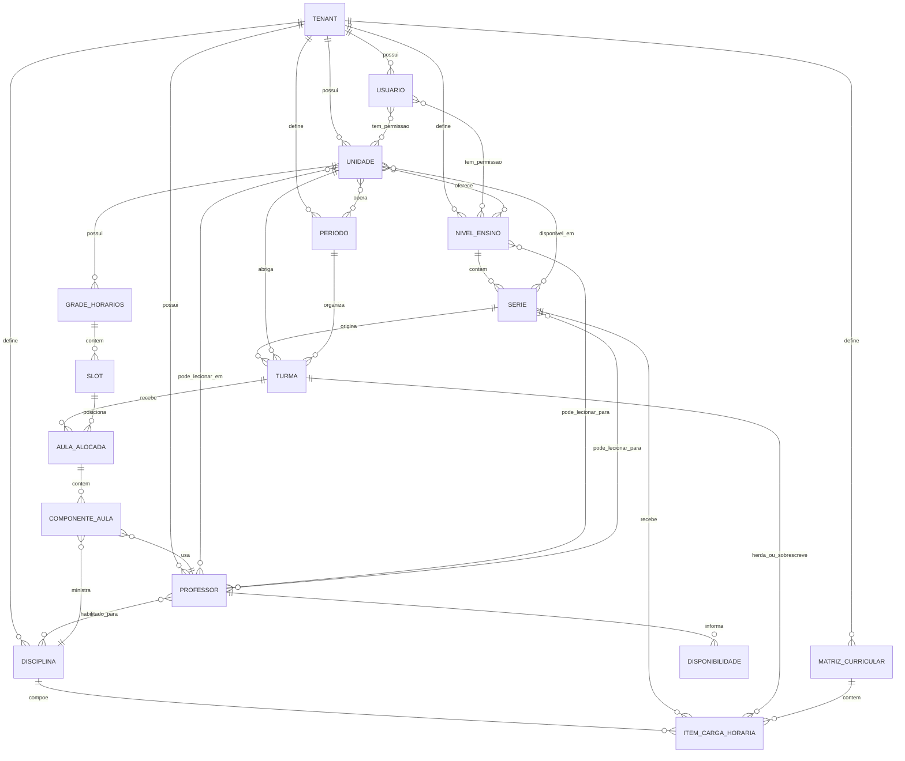
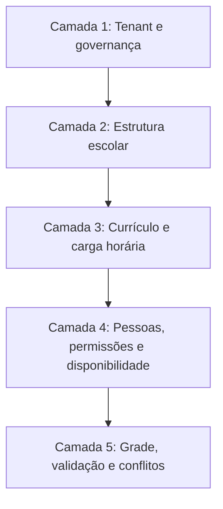
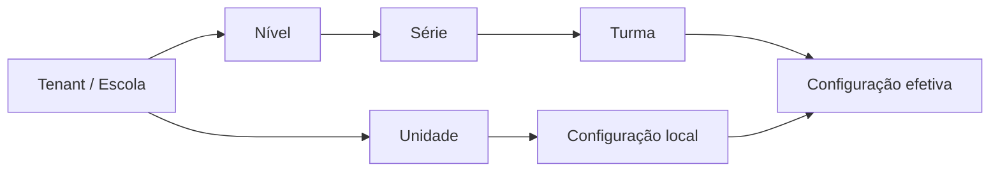
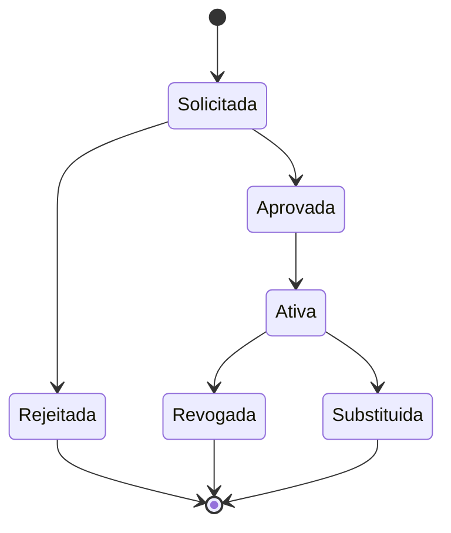
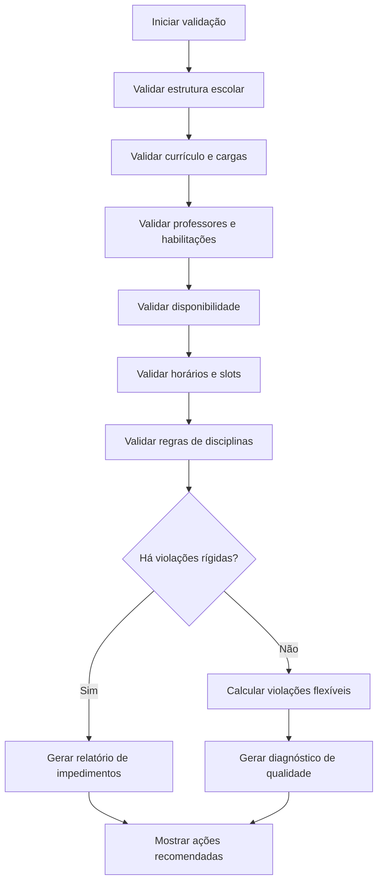
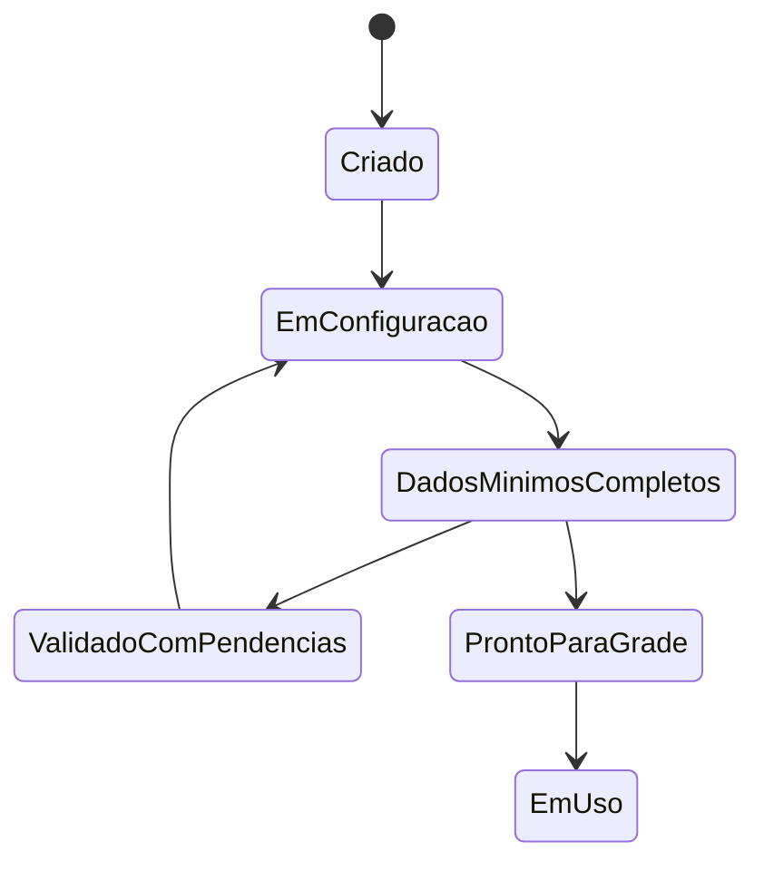
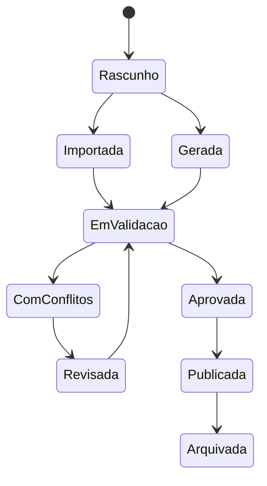
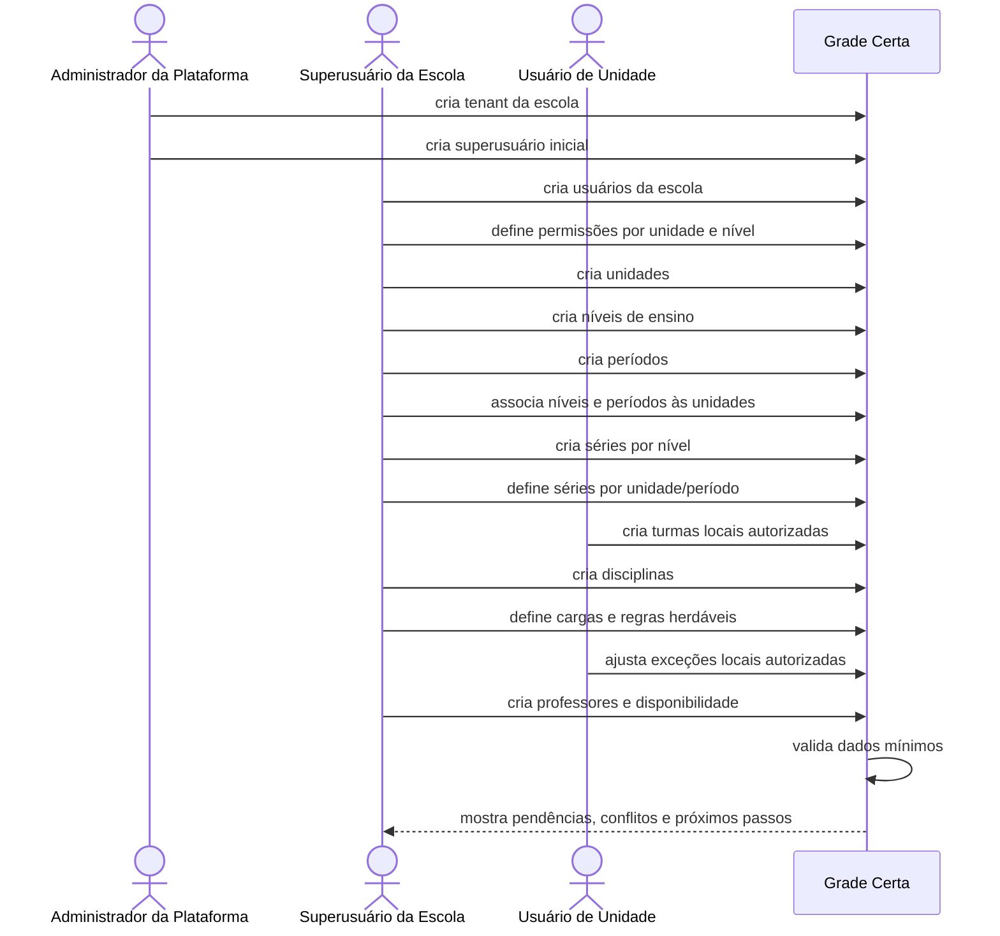
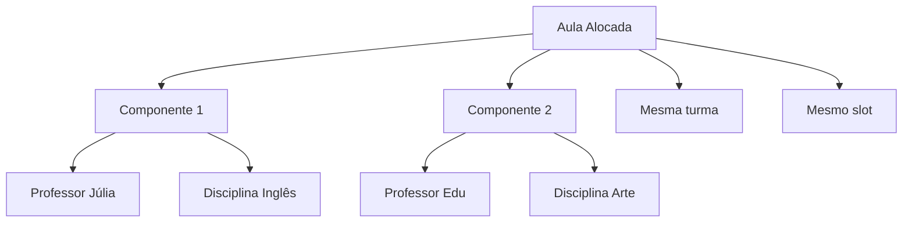
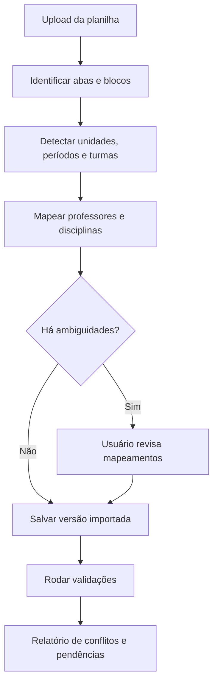

# Grade Certa — SDD Conceitual (System/Domain Design Document)

> **Status:** rascunho revisado de modelagem de domínio  
> **Versão:** 0.4  
> **Fonte principal:** `/opt/data/SmartSchedule/docs/modelagem-entidades-grade-certa.md`  
> **Contexto complementar:** `/opt/data/SmartSchedule/docs/regras-negocio.md`  
> **Escopo deste documento:** desenho conceitual do sistema, entidades de domínio, relações, regras, fluxos e estados.  
> **Fora de escopo neste momento:** código, arquitetura técnica, framework, banco de dados físico, endpoints, estrutura de pastas e implementação do algoritmo.

---

## 1. Intenção do SDD

Este SDD descreve o desenho conceitual do **Grade Certa** a partir das regras de negócio conhecidas.

O objetivo é responder:

- quais conceitos existem no domínio;
- como eles se relacionam;
- quais regras controlam essas relações;
- quais fluxos operacionais precisam existir;
- quais decisões devem ser visíveis e explicáveis;
- onde há herança, exceção, permissão e validação.

Este documento usa linguagem de modelagem, mas ainda não define implementação.

---

## 2. Regras gerais de identificação

Se qualquer entidade for modelada futuramente, seu identificador deve ser um **UUID**.

Regra geral:

```text
Toda entidade relevante do domínio deve ter um id UUID.
```

Entidades conceituais com UUID:

- Tenant;
- Usuário;
- Perfil/Papel;
- Unidade;
- Nível de Ensino;
- Período;
- Série;
- Turma;
- Disciplina;
- Código de Disciplina;
- Matriz Curricular;
- Item de Carga Horária;
- Professor;
- Disponibilidade do Professor;
- Grade de Horários;
- Slot;
- Regra de Disciplina;
- Regra de Herança;
- Exceção Local;
- Aula Planejada/Alocada;
- Componente de Aula;
- Validação;
- Conflito;
- Versão de Grade;
- Ano/Ciclo Letivo;
- Importação de Grade (futuro, fora do MVP);
- Mapeamento de Importação (futuro, fora do MVP).

---

## 3. Modelo conceitual de alto nível



Observação: o diagrama expressa relações conceituais, não cardinalidades técnicas definitivas.

---

## 4. Camadas do domínio

O domínio pode ser entendido em cinco camadas conceituais:



### 4.1 Tenant e governança

Controla a escola/rede, seus usuários e isolamento de dados.

### 4.2 Estrutura escolar

Controla unidades, níveis, períodos, séries e turmas.

### 4.3 Currículo e carga horária

Controla disciplinas, matrizes curriculares, cargas semanais, regras de aula dupla e compartilhamento.

### 4.4 Pessoas e disponibilidade

Controla professores, habilitações, unidades em que podem atuar, níveis/séries que podem lecionar e disponibilidade.

### 4.5 Grade, validação e conflitos

Controla horários, slots, alocações, versões de grade, conflitos e explicações.

---

## 5. Entidades de governança

### 5.1 Tenant

Representa a escola, rede ou grupo educacional cliente.

Atributos conceituais:

- id UUID;
- nome;
- status;
- timezone;
- ano/período letivo ativo;
- configurações padrão;
- política de herança;
- política de permissões.

Regras:

- todo dado escolar pertence a um tenant;
- usuários de um tenant não acessam dados de outro;
- o administrador da plataforma cria o tenant;
- o administrador da plataforma cria o primeiro superusuário.

### 5.2 Usuário

Representa pessoa com acesso ao tenant.

Atributos conceituais:

- id UUID;
- tenant;
- email;
- nome;
- sobrenome;
- status;
- papéis;
- permissões por unidade;
- permissões por nível de ensino.

Regras:

- superusuário pode criar outros usuários;
- usuário pode ter acesso a todas ou algumas unidades;
- usuário pode ter acesso a todos ou alguns níveis;
- deve existir ação de “selecionar todas” para unidades e níveis;
- permissões determinam o que o usuário vê e edita.

### 5.3 Papel/Perfil

Representa conjunto de responsabilidades.

Papéis conceituais iniciais:

- Administrador da Plataforma;
- Superusuário da Escola;
- Usuário de Unidade;
- Usuário de Nível;
- Visualizador.

Regras:

- papéis não substituem escopo de permissão;
- papel define tipo de ação;
- unidade/nível define alcance da ação.

---

## 6. Entidades da estrutura escolar

### 6.1 Unidade

Representa campus, escola física ou unidade administrativa.

Atributos conceituais:

- id UUID;
- tenant;
- nome;
- código;
- endereço opcional;
- status;
- níveis oferecidos;
- períodos operados;
- grade de horários local;
- regras locais.

Regras:

- unidade pertence a um tenant;
- unidade pode ter múltiplos níveis;
- unidade pode ter múltiplos períodos;
- unidade pode herdar configurações globais;
- unidade pode ter exceções locais.

### 6.2 Nível de Ensino

Representa categoria pedagógica ampla.

Exemplos:

- Fundamental Anos Iniciais;
- Fundamental Anos Finais;
- Médio.

Atributos conceituais:

- id UUID;
- tenant;
- nome;
- ordem;
- status.

Regras:

- nível pertence ao tenant;
- nível pode estar disponível em várias unidades;
- usuários podem receber permissão por nível;
- séries pertencem a níveis.

### 6.3 Período

Representa recorte operacional de funcionamento. No estudo de caso, manhã e tarde são períodos distintos, com populações de alunos diferentes, mas com a mesma quantidade total de aulas na semana.

Exemplos:

- manhã;
- tarde;
- noite;
- integral (composição de blocos/turnos);
- contraturno;
- personalizado.

Atributos conceituais:

- id UUID;
- tenant;
- nome;
- código opcional;
- ordem;
- descrição;
- status.

Regras:

- período pertence ao tenant;
- período pode estar ativo em uma ou várias unidades;
- unidade pode operar mais de um período;
- período não deve ser confundido com turma;
- no estudo de caso, manhã e tarde são períodos distintos com mesma carga semanal total;
- período integral deve ser modelado como composição de blocos/turnos, porque isso expressa melhor jornadas com manhã, almoço e tarde do que um período único opaco.

### 6.4 Série

Representa ano/série escolar dentro de um nível.

Atributos conceituais:

- id UUID;
- tenant;
- nível;
- nome;
- código;
- ordem;
- matriz curricular padrão.

Regras:

- série pertence a um nível;
- série pode ser disponibilizada para várias unidades;
- série pode existir em diferentes períodos;
- configurações de série podem ser herdadas por turmas.

### 6.5 Turma

Representa grupo de alunos de uma série, unidade e período.

Atributos conceituais:

- id UUID;
- tenant;
- unidade;
- nível;
- série;
- período;
- ano/ciclo letivo;
- nome;
- código;
- status;
- configuração efetiva de carga horária.

Regras:

- turma pertence a uma unidade;
- turma pertence a uma série;
- turma opera em um período;
- turma existe dentro de um ano/ciclo letivo;
- turma herda cargas e regras da série quando aplicável;
- turma pode ter exceções locais;
- turma não pode ter duas aulas obrigatórias simultâneas, salvo regra explícita de divisão/subgrupo.

### 6.6 Ano/Ciclo Letivo

Representa o recorte temporal para o qual a escola planeja sua operação.

Atributos conceituais:

- id UUID;
- tenant;
- nome;
- data de início;
- data de fim;
- status: planejamento, ativo, encerrado ou arquivado.

Regras:

- turmas devem estar vinculadas a um ano/ciclo letivo;
- matriz curricular pode mudar por ano/ciclo;
- disponibilidade de professores pode mudar por ano/ciclo;
- versões de grade pertencem a um ano/ciclo;
- a escola pode planejar o próximo ciclo enquanto mantém o ciclo atual publicado.

---

## 7. Entidades curriculares

### 7.1 Disciplina

Representa componente curricular.

Atributos conceituais:

- id UUID;
- tenant;
- nome;
- code opcional;
- slug opcional;
- status;
- regras pedagógicas.

Regras:

- disciplina pertence ao tenant;
- disciplina deve poder ter código local;
- códigos não são universais entre escolas;
- uma disciplina pode ter regras específicas de aula dupla e compartilhamento.

### 7.2 Código de Disciplina

O código da disciplina não é uma entidade separada nesta modelagem: ele é um campo da própria disciplina.

Regra importante:

- cada disciplina deve ter, no máximo, um código local;
- se duas variações precisarem de códigos diferentes, elas devem ser modeladas como disciplinas distintas;
- exemplo: `Ciências` e `Ciências (laboratório)` não compartilham o mesmo código, porque são disciplinas diferentes;
- importações devem mapear o código da planilha para uma disciplina única.

### 7.3 Matriz Curricular

Representa conjunto de disciplinas e cargas esperadas para uma série, unidade ou turma.

Atributos conceituais:

- id UUID;
- tenant;
- escopo: escola, unidade, nível, série ou turma;
- ano/período letivo;
- itens de carga horária;
- status.

Regras:

- matriz pode existir no nível global da escola;
- série pode herdar matriz global;
- turma pode herdar matriz da série;
- unidade pode ajustar matriz herdada;
- mudanças precisam ser rastreáveis como regra de negócio, ainda que a implementação futura defina como.

### 7.4 Item de Carga Horária

Representa quantas aulas uma disciplina deve ter por semana em um escopo.

Atributos conceituais:

- id UUID;
- matriz curricular;
- disciplina;
- quantidade de aulas semanais;
- duração esperada;
- origem: herdada ou local;
- regra de aula dupla;
- regra de compartilhamento.

Regras:

- carga pode ser definida por escola;
- série herda carga da escola;
- turma herda carga da série;
- unidade/turma podem editar exceções;
- sistema deve mostrar origem da carga;
- soma das cargas deve caber na grade de slots da turma.

---

## 8. Entidades de professores

### 8.1 Professor

Representa docente.

Atributos conceituais:

- id UUID;
- tenant;
- nome;
- email;
- status;
- disciplinas habilitadas;
- unidades permitidas;
- níveis permitidos;
- séries permitidas;
- disponibilidade;
- limite de janelas semanais.

Regras:

- professor pode lecionar múltiplas disciplinas;
- professor pode lecionar em múltiplas unidades;
- professor pode estar limitado a níveis ou séries;
- professor não pode ser alocado em dois lugares simultaneamente;
- professor não pode ser alocado fora da disponibilidade rígida;
- número de janelas é uma restrição flexível, ajustável pela política da escola.

### 8.2 Habilitação do Professor

Nesta modelagem, habilitação não é uma entidade separada.

As habilitações já são representadas pelos atributos do próprio Professor:

- disciplinas que pode lecionar;
- unidades em que pode lecionar;
- níveis em que pode lecionar;
- séries em que pode lecionar;
- eventuais restrições adicionais por política da escola.

Regra:

- uma disciplina só pode ser alocada a um professor cuja habilitação efetiva permita aquela combinação de disciplina, unidade, nível e série.

### 8.3 Disponibilidade do Professor

Representa a disponibilidade semanal recorrente do professor.

O professor informa explicitamente os dias e faixas de horário em que pode lecionar; qualquer horário não marcado como disponível deve ser tratado como indisponível por padrão.

Estados/flags possíveis por faixa:

- disponível;
- indisponível;
- preferencial;
- bloqueado por compromisso fixo.

Regras:

- a indisponibilidade rígida invalida alocação;
- a preferência afeta qualidade, mas pode ser violada;
- a disponibilidade deve ser modelada por dia da semana e intervalo de horário, alinhada aos slots das unidades/períodos;
- horários não informados pelo professor não contam como disponibilidade implícita;
- quando o professor atua em várias unidades, deslocamento precisa ser considerado.

---

## 9. Entidades de horário e grade

### 9.1 Grade de Horários

Representa estrutura de slots de uma escola ou unidade.

Atributos conceituais:

- id UUID;
- tenant;
- escopo: escola ou unidade;
- período;
- dias da semana;
- slots;
- origem: padrão ou local.

Regras:

- escola pode ter grade padrão;
- unidade herda grade padrão;
- unidade pode editar grade local;
- grade pode variar por período;
- grade pode ter 5, 6 ou outro número de aulas por dia;
- integral deve permitir blocos de manhã, almoço, tarde e contraturno.

### 9.2 Slot

Representa bloco temporal.

Atributos conceituais:

- id UUID;
- grade de horários;
- dia da semana;
- ordem;
- início;
- fim;
- tipo: aula, intervalo, almoço, bloqueio;
- aceita aula dupla;
- observação.

Regras:

- slot de intervalo não recebe aula;
- slot bloqueado não recebe aula;
- slot vazio não é permitido na grade final;
- qualquer slot sem ocupação explícita indica que a grade está incompleta ou inválida.

### 9.3 Espaço Físico (fora de escopo)

Fora de escopo desta versão conceitual.

O domínio inicial do Grade Certa não precisa de espaço físico para validar ou montar a grade horária. Se isso voltar a ser necessário no futuro, deve entrar como extensão separada do modelo.

### 9.4 Aula Alocada

Representa uma decisão de grade para uma turma em um slot.

Atributos conceituais:

- id UUID;
- tenant;
- versão da grade;
- turma;
- slot;
- unidade;
- status;
- componentes de aula;
- justificativa;
- origem: manual, sugerida ou gerada.

Regras:

- uma aula alocada pode ter um ou mais componentes;
- uma aula alocada ocupa um único slot da turma e conta uma vez para a carga da turma;
- componentes permitem representar aulas paralelas, subgrupos ou dupla docência;
- uma turma não pode ter conflito no mesmo slot, salvo composição válida;
- cada componente deve validar professor, disciplina, disponibilidade e regras.

### 9.5 Componente de Aula

Representa parte de uma aula alocada.

Exemplos:

- professor Júlia + disciplina Inglês;
- professor Edu + disciplina Arte;
- professor Angelo + disciplina Ciências;
- professor Narciso + disciplina Ciências.

Atributos conceituais:

- id UUID;
- aula alocada;
- professor;
- disciplina;
- subgrupo opcional;
- carga computada para professor;
- carga computada para turma.

Regras:

- componente pode compartilhar slot com outro componente;
- componente pode representar subgrupo;
- componente pode representar frente da mesma disciplina;
- componente impacta disponibilidade do professor;
- componente impacta contagem de carga horária.

---

## 10. Herança de regras

A herança é um conceito central.



### 10.1 Regra de herança

Uma configuração pode vir de:

- escola/tenant;
- nível;
- série;
- unidade;
- turma.

### 10.2 Exceção local

Uma exceção local substitui uma configuração herdada em escopo específico.

Exemplos:

- todas as turmas de 6º ano têm 5 aulas de Matemática, mas a unidade X usa 6;
- a escola define 6 slots por dia, mas determinada unidade usa 5 na sexta;
- Informática permite aula dupla no geral, mas determinada turma proíbe.

### 10.3 Regra de visualização

O usuário deve conseguir ver:

- valor efetivo;
- origem do valor;
- se é herdado;
- se foi sobrescrito;
- quem tem permissão para editar.

### 10.4 Precedência conceitual de herança

Quando mais de uma camada define a mesma configuração, a precedência é fixa e deve ser exibida ao usuário:

1. exceção específica da turma;
2. exceção da unidade aplicável àquela série/turma/período;
3. configuração da série;
4. configuração do nível de ensino, quando existir;
5. configuração global do tenant/escola.

Essa ordem não é personalizável pela escola nesta fase do produto; mudar isso seria uma nova decisão de produto, não uma preferência do tenant.

### 10.5 Ciclo de vida de uma exceção local

Uma exceção local pode ter estados conceituais:



Regras:

- exceção local deve ter escopo claro;
- exceção deve informar o valor herdado e o valor local;
- exceção crítica pode exigir aprovação do superusuário;
- exceção deve poder ser revertida;
- exceção pode valer apenas para determinado ano/ciclo letivo.

---

## 11. Restrições rígidas e flexíveis

### 11.1 Restrições rígidas

Violação torna a grade inválida.

Exemplos:

- professor em duas aulas no mesmo slot;
- professor fora de disponibilidade indisponível;
- turma com duas aulas obrigatórias simultâneas sem regra de composição;
- disciplina sem professor habilitado;
- carga horária obrigatória não cumprida;
- aula dupla obrigatória separada;
- aula dupla proibida agrupada;
- mais de duas aulas da mesma disciplina no mesmo dia;
- unidade sem slots suficientes;
- usuário editando unidade sem permissão.

### 11.2 Restrições flexíveis

Violação reduz qualidade, mas pode ser aceita.

Exemplos:

- professor com muitas janelas;
- professor em unidade diferente no mesmo dia;
- disciplina pesada no último horário;
- concentração excessiva de uma disciplina no mesmo dia;
- preferência do professor não atendida;
- distribuição semanal pouco equilibrada.

### 11.3 Fluxo de validação



---

## 12. Estados e ciclos de vida

### 12.1 Status de configuração do tenant



### 12.2 Status de versão de grade



---

## 13. Fluxo detalhado de configuração inicial



---

## 14. Regras de permissão

### 14.1 Escopo de acesso

Um usuário pode ter acesso por:

- tenant inteiro;
- unidade específica;
- múltiplas unidades;
- todos os níveis;
- níveis específicos;
- combinação entre unidade e nível.

### 14.2 Pergunta de modelagem importante

É preciso decidir se permissão por unidade e nível deve funcionar como:

```text
Usuário pode editar dados que estejam na unidade autorizada E no nível autorizado.
```

ou:

```text
Usuário pode editar dados que estejam na unidade autorizada OU no nível autorizado.
```

Hipótese recomendada:

- para edição: usar combinação restritiva quando a entidade tiver unidade e nível;
- para visualização: permitir política configurável pelo tenant;
- superusuário ignora esses limites dentro do tenant.

---

## 15. Regras de exibição das entidades

O documento fonte afirma que o sistema deve mostrar cada entidade ao usuário.

Portanto, cada entidade principal deve ter uma visão conceitual de:

- listagem;
- detalhe;
- status;
- origem/herança quando aplicável;
- relações principais;
- pendências;
- conflitos;
- quem pode editar.

Entidades prioritárias para visualização:

- usuários;
- unidades;
- níveis;
- períodos;
- séries;
- turmas;
- disciplinas;
- cargas horárias;
- professores;
- disponibilidades;
- grades de horários;
- regras de disciplina;
- validações e conflitos.

---

## 16. Diagnósticos esperados

O sistema deve produzir diagnósticos antes de gerar grade.

Exemplos:

- unidade sem período ativo;
- série criada, mas não disponível em nenhuma unidade;
- turma sem disciplinas;
- disciplina sem carga horária;
- carga horária da turma maior que slots disponíveis;
- professor sem disciplina habilitada;
- disciplina sem professor habilitado;
- professor sem disponibilidade;
- professor habilitado para disciplina, mas não para a unidade;
- aula dupla obrigatória sem slots consecutivos disponíveis;
- disciplina configurada para dividir horário, mas sem regra de composição clara.

---

## 17. Modelo conceitual de aulas compostas

Aulas compostas são necessárias porque a grade real pode conter dois professores e duas disciplinas no mesmo slot.



Regras conceituais:

- aula composta ocupa um slot da turma;
- pode contar como uma ou mais cargas para a turma, conforme regra;
- cada componente conta para a carga do respectivo professor;
- composição deve ser explícita, não inferida apenas por hífen em texto.

### 17.1 Taxonomia de compartilhamento de horário

“Dividir horário” pode significar coisas diferentes. O sistema deve obrigar a escola a escolher o tipo correto.

Tipos conceituais:

- **Subgrupos paralelos:** a mesma turma é dividida em grupos, cada grupo com professor/disciplina diferente no mesmo slot.
- **Co-docência:** dois professores atuam juntos para a turma inteira.
- **Frentes da mesma disciplina:** a mesma disciplina tem componentes diferentes no mesmo slot.
- **Eletivas simultâneas:** alunos escolhem componentes diferentes no mesmo horário.
- **Professor auxiliar:** um professor titular e um auxiliar aparecem na mesma aula.

A alternância semanal entre grupos não é modelada como conceito separado nesta versão; se existir, ela deve ser tratada como regra operacional da turma ou da disciplina, não como uma entidade própria.

Regras:

- cada tipo afeta carga horária de forma diferente;
- cada tipo afeta conflitos de professor de forma diferente;
- importações não devem assumir automaticamente o significado de um hífen;
- o sistema deve pedir confirmação quando a composição for ambígua.

### 17.2 Regras de dobradinha

Dobradinha é uma regra de distribuição de uma disciplina em blocos consecutivos.

Estados possíveis:

- obrigatória;
- permitida;
- proibida;
- preferencial.

Perguntas/regras que precisam ser configuráveis:

- dobradinha deve sempre usar slots consecutivos no mesmo dia?
- pode atravessar intervalo curto?
- pode atravessar almoço?
- carga semanal 3 pode virar 2+1?
- carga semanal 4 deve virar 2+2 ou pode ser 2+1+1?
- uma disciplina pode ter uma dobradinha obrigatória e aulas simples adicionais?

---

## 18. Extensão futura de importação de grade e mapeamento



Entidades conceituais:

- Importação de Grade (futuro, fora do MVP);
- Arquivo Importado (futuro, fora do MVP);
- Mapeamento de Professor (futuro, fora do MVP);
- Mapeamento de Disciplina (futuro, fora do MVP);
- Mapeamento de Turma (futuro, fora do MVP);
- Item Ambíguo (futuro, fora do MVP);
- Validação Pós-importação.

Regras:

- importação sempre deve gerar versão revisável, não grade definitiva automaticamente;
- código desconhecido deve virar pendência de mapeamento;
- aula composta ambígua deve exigir confirmação;
- conflito detectado após importação deve ser explicado, não apenas marcado como erro.

---

## 19. Versionamento de grade

Uma grade deve ter versões conceituais porque a escola trabalha com rascunhos, versões provisórias, revisões e publicações.

Regras:

- versão pertence a um ano/ciclo letivo;
- versão pode ser manual, sugerida ou gerada; importação fica para uma extensão futura;
- versão publicada não deve ser alterada silenciosamente;
- nova alteração relevante deve criar nova versão ou revisão;
- deve ser possível comparar versões;
- deve ser possível arquivar versões antigas;
- aprovação/publicação deve respeitar permissões.

---

## 20. Glossário mínimo

- **Tenant:** escola, rede ou grupo educacional cliente do SaaS.
- **Unidade:** campus ou escola física dentro do tenant.
- **Nível de ensino:** agrupamento pedagógico amplo, como Fundamental Anos Finais ou Ensino Médio.
- **Período/turno:** recorte operacional de funcionamento, como manhã, tarde, noite ou integral.
- **Série:** ano escolar dentro de um nível.
- **Turma:** grupo concreto de alunos de uma série, unidade e período.
- **Matriz curricular:** conjunto de disciplinas e cargas esperadas para um escopo.
- **Carga horária:** quantidade de aulas exigidas por disciplina em determinado escopo.
- **Slot:** bloco de tempo em que uma aula pode acontecer.
- **Janela:** intervalo vazio entre aulas de um professor no mesmo dia.
- **Dobradinha:** aula em dois slots consecutivos ou bloco equivalente configurado pela escola.
- **Aula composta:** aula com mais de um componente, professor, disciplina, subgrupo ou frente.
- **Componente de aula:** parte de uma aula composta vinculada a professor/disciplina/subgrupo.
- **Restrição rígida:** regra cuja violação torna a grade inválida.
- **Restrição flexível:** preferência cuja violação reduz qualidade, mas não invalida necessariamente a grade.
- **Exceção local:** configuração que sobrescreve uma regra herdada em escopo específico.

---

## 21. Decisões de modelagem já assumidas

1. Todos os IDs devem ser UUID.
2. O sistema é multi-tenant.
3. Unidade e período são conceitos separados.
4. Série e turma são conceitos separados.
5. Disciplina tem código local na própria entidade, não como entidade separada.
6. Carga horária pode ser herdada e sobrescrita.
7. Permissões por unidade e por nível se combinam por interseção.
8. Disponibilidade de professor é parte essencial do domínio.
9. Aula alocada pode ter múltiplos componentes e conta uma vez para a turma.
10. Validação e explicação são partes do produto, não acessórios.

---

## 22. Decisões consolidadas da versão 0.3

1. Permissões de unidade e nível se combinam por **interseção**.
2. Exceções locais **não precisam de aprovação adicional**.
3. **Período integral** deve ser modelado como **composição de blocos/turnos**.
4. **Dobradinha obrigatória** deve usar **slots consecutivos no mesmo dia**.
5. Quando uma disciplina divide horário com outra, isso representa **subgrupos com revezamento semanal**; não é necessário modelar alternância como conceito separado.
6. O número de janelas do professor é uma **restrição flexível**.
7. **Aula composta conta uma vez para a turma**; cada componente conta para o respectivo professor.
8. Usuário de unidade **pode alterar carga herdada**.
9. Uma unidade **pode ter séries em períodos diferentes simultaneamente**.
10. **Slot vazio não é permitido** na grade final; se houver vazio, a grade ainda não está pronta.

---

## 23. Critério de prontidão conceitual

O domínio estará pronto para avançar para desenho técnico somente quando for possível responder, com exemplos:

- como um tenant é configurado do zero;
- como usuários recebem escopos;
- como unidade, nível, período, série e turma se conectam;
- como carga horária é herdada e sobrescrita;
- como professores são habilitados e bloqueados;
- como aulas duplas, proibidas e compartilhadas são representadas;
- como o sistema explica dados faltantes;
- como o sistema explica conflito de regras;
- como uma grade existente poderia ser importada e validada.


