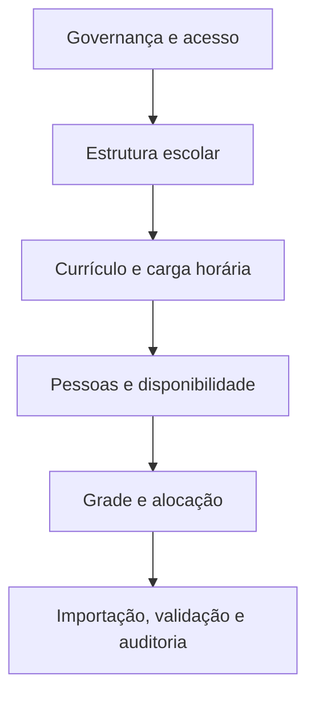
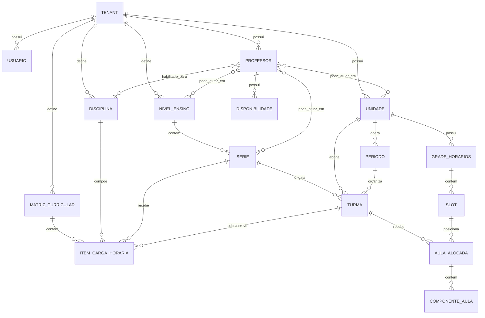

# Grade Certa — Modelagem de Entidades

> **Status:** rascunho de modelagem de domínio  
> **Versão:** 0.9  
> **Objetivo:** organizar as entidades centrais do Grade Certa antes do planejamento de entrega e da implementação.  
> **Escopo:** conceitos, entidades, relações, atributos essenciais, ciclos de vida e perguntas em aberto.  
> **Fora de escopo:** código, framework, estrutura física do banco, endpoints, telas finais e algoritmo de geração.

---

## 1. Por que este documento existe

Antes de planejar sprints ou detalhar implementação, o sistema precisa ter um **modelo claro das entidades de negócio**.

Este documento serve como base para:

- alinhar vocabulário do domínio;
- separar o que é entidade, regra e relacionamento;
- identificar agregados e dependências;
- evitar que o planejamento nasça com entidades erradas ou faltando;
- apoiar o futuro SDD e o backlog de desenvolvimento.

---

## 2. Princípios da modelagem

1. **Tudo pertence a um tenant.**
   Nenhuma entidade acadêmica existe fora do contexto da escola/rede cliente.

2. **Identificadores serão UUIDs.**
   Toda entidade principal deve poder ser identificada de forma global e não ambígua.

3. **Herança deve ser explícita.**
   Regras herdadas de nível superior precisam indicar sua origem.

4. **Exceções locais são parte do modelo.**
   Unidade, série, turma ou professor podem ter variações sobre a regra padrão.

5. **Dados vêm antes da automação.**
   O sistema primeiro cadastra, valida e organiza; depois sugere ou gera.

6. **Explicabilidade é requisito de domínio.**
   Quando houver conflito, o sistema deve conseguir mostrar o motivo.

7. **Evitar misturar domínio com implementação.**
   Este documento modela conceitos, não tabelas nem classes técnicas.

---

## 3. Visão macro do domínio

O domínio do Grade Certa pode ser separado em seis blocos:

1. **Governança e acesso**
2. **Estrutura escolar**
3. **Currículo e carga horária**
4. **Pessoas e disponibilidade**
5. **Grade e alocação**
6. **Importação, validação e auditoria**

---

## 4. Entidades centrais por domínio

> **Leitura rápida:** esta seção apresenta as entidades de forma mais detalhada e já com nomes de campos em inglês. Relações já indicam o tipo quando relevante; a seção 11 continua sendo a referência exata e consolidada de campos, tipos e cardinalidades.

### 4.1 Governança e acesso

#### Tenant
Representa a escola, rede ou grupo educacional cliente.

**Campos principais (backend):**
- `id` (`UUID`, obrigatório)
- `name` (`string`, obrigatório)
- `slug` (`string`, obrigatório, único)
- `status` (`enum tenant_status`, obrigatório)
- `timezone` (`string`, obrigatório, formato IANA)
- `default_settings` (`json`, obrigatório)
- `active_school_year_id` (`UUID`, FK to `SchoolYear`, opcional)
- `created_at` (`datetime`, obrigatório)
- `updated_at` (`datetime`, obrigatório)

**Relacionamentos:**
- possui `User`
- possui `Unit`
- define `TeachingLevel`
- define `Subject`
- define `Teacher`
- define `CurriculumMatrix`
- define `Timetable`

**Regras:**
- todo dado operacional pertence a um tenant;
- não existe compartilhamento implícito entre tenants;
- o tenant é a fronteira de isolamento de dados.

#### Usuário (User)
Pessoa com acesso ao tenant.

**Campos principais (backend):**
- `id` (`UUID`, obrigatório)
- `tenant_id` (`UUID`, FK to `Tenant`, obrigatório)
- `email` (`string`, obrigatório, único por tenant)
- `first_name` (`string`, obrigatório)
- `last_name` (`string`, obrigatório)
- `status` (`enum user_status`, obrigatório)
- `is_active` (`bool`, obrigatório, default `true`)
- `last_login_at` (`datetime`, opcional)
- `created_at` (`datetime`, obrigatório)
- `updated_at` (`datetime`, obrigatório)

**Relacionamentos:**
- possui várias `RoleAssignment`
- pode ter escopo por `Unit` e/ou `TeachingLevel` via `RoleAssignment`

**Regras:**
- o usuário pode ter acesso por unidade, por nível de ensino ou ambos;
- permissões determinam leitura, edição e criação;
- um usuário sem nenhuma atribuição de papel não pode operar o sistema;
- os nomes de campos no backend devem ficar em inglês.

#### Atribuição de Papel (RoleAssignment)
Entidade de vínculo entre usuário e papel, com escopos por unidades e níveis de ensino.

**Campos principais (backend):**
- `id` (`UUID`, obrigatório)
- `tenant_id` (`UUID`, FK to `Tenant`, obrigatório)
- `user_id` (`UUID`, FK to `User`, obrigatório)
- `role_id` (`UUID`, FK to `RoleProfile`, obrigatório)
- `units` (`M2M` com `Unit`, opcional)
- `teaching_levels` (`M2M` com `TeachingLevel`, opcional)
- `is_active` (`bool`, obrigatório, default `true`)
- `granted_by_user_id` (`UUID`, FK to `User`, opcional)
- `granted_at` (`datetime`, opcional)
- `created_at` (`datetime`, obrigatório)
- `updated_at` (`datetime`, obrigatório)

**Relacionamentos:**
- pertence a um `User`
- referencia um `RoleProfile`
- pode apontar para várias `Unit`
- pode apontar para vários `TeachingLevel`

**Regras:**
- uma atribuição sempre pertence a um tenant;
- o papel pode valer para nenhuma, uma ou várias unidades;
- o papel pode valer para nenhum, um ou vários níveis de ensino;
- `units` e `teaching_levels` são relações many-to-many separadas;
- quando ambas as relações estiverem vazias, a atribuição vale no tenant inteiro, se a regra do papel permitir.

#### Papel/Perfil (RoleProfile)
Define a função operacional do usuário.

**Campos principais (backend):**
- `id` (`UUID`, obrigatório)
- `tenant_id` (`UUID`, FK to `Tenant`, opcional)
- `code` (`string`, obrigatório)
- `name` (`string`, obrigatório)
- `description` (`string`, opcional)
- `default_scope` (`enum role_scope_type`, obrigatório)
- `is_system` (`bool`, obrigatório, default `false`)
- `is_active` (`bool`, obrigatório, default `true`)
- `created_at` (`datetime`, obrigatório)
- `updated_at` (`datetime`, obrigatório)

**Regras:**
- papel define responsabilidade;
- escopo define alcance;
- papéis de sistema podem ser globais ou padrão do tenant.

### 4.2 Estrutura escolar

#### Unidade (Unit)
Representa escola, campus, filial ou unidade operacional.

**Campos principais (backend):**
- `id` (`UUID`, obrigatório)
- `tenant_id` (`UUID`, FK to `Tenant`, obrigatório)
- `code` (`string`, opcional)
- `name` (`string`, obrigatório)
- `status` (`enum unit_status`, obrigatório)
- `timezone` (`string`, opcional, formato IANA)
- `default_settings` (`json`, obrigatório)
- `created_at` (`datetime`, obrigatório)
- `updated_at` (`datetime`, obrigatório)

**Relacionamentos:**
- pertence a um `Tenant`
- possui `Period`
- participa de `RoleAssignment`
- participa de `TeacherQualification`
- possui `Timetable`
- pode ser escopo de acesso

**Regras:**
- pertence a um tenant;
- pode herdar configurações globais e ter exceções locais;
- pode possuir períodos, séries e turmas.

#### Nível de Ensino (TeachingLevel)
Agrupa séries com características pedagógicas semelhantes.

**Campos principais (backend):**
- `id` (`UUID`, obrigatório)
- `tenant_id` (`UUID`, FK to `Tenant`, obrigatório)
- `code` (`string`, opcional)
- `name` (`string`, obrigatório)
- `order` (`integer`, obrigatório)
- `status` (`enum teaching_level_status`, obrigatório)
- `created_at` (`datetime`, obrigatório)
- `updated_at` (`datetime`, obrigatório)

**Relacionamentos:**
- pertence a um `Tenant`
- possui várias `Series`
- participa de `RoleAssignment`
- pode participar de `TeacherQualification`

#### Período (Period)
Recorte operacional da unidade dentro do ciclo letivo. No estudo de caso, equivale ao turno operacional da escola (manhã ou tarde), com população de alunos distinta e grade semanal própria.

**Campos principais (backend):**
- `id` (`UUID`, obrigatório)
- `tenant_id` (`UUID`, FK to `Tenant`, obrigatório)
- `unit_id` (`UUID`, FK to `Unit`, obrigatório)
- `name` (`string`, obrigatório)
- `type` (`enum period_type`, obrigatório, representa o turno operacional)
- `order` (`integer`, obrigatório)
- `status` (`enum period_status`, obrigatório)
- `start_time` (`time`, opcional)
- `end_time` (`time`, opcional)
- `created_at` (`datetime`, obrigatório)
- `updated_at` (`datetime`, obrigatório)

**Relacionamentos:**
- pertence a uma `Unit`
- organiza `ClassGroup`

#### Série (Series)
Representa o ano/série escolar dentro de um nível.

**Campos principais (backend):**
- `id` (`UUID`, obrigatório)
- `tenant_id` (`UUID`, FK to `Tenant`, obrigatório)
- `teaching_level_id` (`UUID`, FK to `TeachingLevel`, obrigatório)
- `code` (`string`, opcional)
- `name` (`string`, obrigatório)
- `order` (`integer`, obrigatório)
- `status` (`enum series_status`, obrigatório)
- `created_at` (`datetime`, obrigatório)
- `updated_at` (`datetime`, obrigatório)

**Relacionamentos:**
- pertence a um `TeachingLevel`
- pode ser usada em `CurriculumMatrix`
- pode ser usada em `ClassGroup`
- pode aparecer em `WorkloadItem`

#### Turma (ClassGroup)
Agrupamento concreto de alunos em uma unidade, período e série.

**Campos principais (backend):**
- `id` (`UUID`, obrigatório)
- `tenant_id` (`UUID`, FK to `Tenant`, obrigatório)
- `unit_id` (`UUID`, FK to `Unit`, obrigatório)
- `period_id` (`UUID`, FK to `Period`, obrigatório)
- `series_id` (`UUID`, FK to `Series`, obrigatório)
- `school_year_id` (`UUID`, FK to `SchoolYear`, obrigatório)
- `code` (`string`, opcional)
- `name` (`string`, obrigatório)
- `status` (`enum class_group_status`, obrigatório)
- `created_at` (`datetime`, obrigatório)
- `updated_at` (`datetime`, obrigatório)

**Relacionamentos:**
- pertence a uma `Unit`
- pertence a um `Period`
- pertence a uma `Series`
- pertence a um `SchoolYear`
- recebe `WorkloadItem`
- recebe `LessonAssignment`

### 4.3 Currículo e carga horária

#### Disciplina (Subject)
Componente curricular que será alocado na grade.

**Campos principais (backend):**
- `id` (`UUID`, obrigatório)
- `tenant_id` (`UUID`, FK to `Tenant`, obrigatório)
- `code` (`string`, opcional)
- `name` (`string`, obrigatório)
- `slug` (`string`, opcional)
- `status` (`enum subject_status`, obrigatório)
- `created_at` (`datetime`, obrigatório)
- `updated_at` (`datetime`, obrigatório)

**Relacionamentos:**
- pertence a um `Tenant`
- participa de `WorkloadItem`
- participa de `SubjectRule`
- participa de `TeacherQualification`
- participa de `LessonAssignment`

#### Matriz Curricular (CurriculumMatrix)
Define a estrutura curricular de uma série ou conjunto de séries.

**Campos principais (backend):**
- `id` (`UUID`, obrigatório)
- `tenant_id` (`UUID`, FK to `Tenant`, obrigatório)
- `name` (`string`, obrigatório)
- `teaching_level_id` (`UUID`, FK to `TeachingLevel`, obrigatório)
- `series_id` (`UUID`, FK to `Series`, opcional)
- `version` (`string`, obrigatório)
- `status` (`enum curriculum_matrix_status`, obrigatório)
- `effective_from` (`date`, opcional)
- `effective_to` (`date`, opcional)
- `created_at` (`datetime`, obrigatório)
- `updated_at` (`datetime`, obrigatório)

**Relacionamentos:**
- pertence a um `Tenant`
- pertence a um `TeachingLevel`
- pode apontar para uma `Series`
- contém `WorkloadItem`

#### Item de Carga Horária (WorkloadItem)
Representa a carga semanal ou total exigida para uma disciplina em determinado contexto.

**Campos principais (backend):**
- `id` (`UUID`, obrigatório)
- `tenant_id` (`UUID`, FK to `Tenant`, obrigatório)
- `curriculum_matrix_id` (`UUID`, FK to `CurriculumMatrix`, obrigatório)
- `series_id` (`UUID`, FK to `Series`, obrigatório)
- `class_group_id` (`UUID`, FK to `ClassGroup`, opcional)
- `weekly_lessons` (`integer`, obrigatório)
- `lesson_duration_min` (`integer`, obrigatório)
- `is_double_lesson` (`bool`, obrigatório, default `false`)
- `can_share` (`bool`, obrigatório, default `false`)
- `notes` (`string`, opcional)
- `created_at` (`datetime`, obrigatório)
- `updated_at` (`datetime`, obrigatório)

**Relacionamentos:**
- pertence a uma `CurriculumMatrix`
- pertence a uma `Subject`
- pertence a uma `Series`
- pode sobrescrever uma `ClassGroup`

#### Regra de Disciplina (SubjectRule)
Define comportamento específico da disciplina.

**Campos principais (backend):**
- `id` (`UUID`, obrigatório)
- `tenant_id` (`UUID`, FK to `Tenant`, obrigatório)
- `rule_type` (`enum subject_rule_type`, obrigatório)
- `payload` (`json`, obrigatório)
- `is_active` (`bool`, obrigatório, default `true`)
- `notes` (`string`, opcional)
- `created_at` (`datetime`, obrigatório)
- `updated_at` (`datetime`, obrigatório)

#### Regra de Herança (InheritanceRule)
Registra como uma regra ou configuração se propaga.

**Campos principais (backend):**
- `id` (`UUID`, obrigatório)
- `tenant_id` (`UUID`, FK to `Tenant`, obrigatório)
- `source_type` (`enum inheritance_source_type`, obrigatório)
- `source_id` (`UUID`, polymorphic relation resolved by `source_type`, obrigatório)
- `target_type` (`enum inheritance_target_type`, obrigatório)
- `target_id` (`UUID`, polymorphic relation resolved by `target_type`, obrigatório)
- `rule_type` (`enum inheritance_rule_type`, obrigatório)
- `priority` (`integer`, obrigatório, default `0`)
- `is_active` (`bool`, obrigatório, default `true`)
- `created_at` (`datetime`, obrigatório)
- `updated_at` (`datetime`, obrigatório)

#### Exceção Local (LocalException)
Sobrescrita de uma regra herdada.

**Campos principais (backend):**
- `id` (`UUID`, obrigatório)
- `tenant_id` (`UUID`, FK to `Tenant`, obrigatório)
- `inheritance_rule_id` (`UUID`, FK to `InheritanceRule`, obrigatório)
- `scope_type` (`enum exception_scope_type`, obrigatório)
- `scope_id` (`UUID`, polymorphic relation resolved by `scope_type`, obrigatório)
- `original_value` (`json`, obrigatório)
- `override_value` (`json`, obrigatório)
- `reason` (`string`, obrigatório)
- `is_active` (`bool`, obrigatório, default `true`)
- `created_at` (`datetime`, obrigatório)
- `updated_at` (`datetime`, obrigatório)

### 4.4 Pessoas e disponibilidade

#### Professor (Teacher)
Pessoa que ministra disciplinas.

**Campos principais (backend):**
- `id` (`UUID`, obrigatório)
- `tenant_id` (`UUID`, FK to `Tenant`, obrigatório)
- `code` (`string`, opcional)
- `name` (`string`, obrigatório)
- `email` (`string`, opcional)
- `phone_number` (`string`, opcional)
- `status` (`enum teacher_status`, obrigatório)
- `max_weekly_load` (`integer`, opcional)
- `notes` (`string`, opcional)
- `created_at` (`datetime`, obrigatório)
- `updated_at` (`datetime`, obrigatório)

**Relacionamentos:**
- pertence a um `Tenant`
- possui `TeacherQualification`
- possui `TeacherAvailability`
- pode ser alocado em `LessonAssignment`

#### Habilitação do Professor (TeacherQualification)
Relaciona professor com disciplina, nível, série ou unidade.

**Campos principais (backend):**
- `id` (`UUID`, obrigatório)
- `tenant_id` (`UUID`, FK to `Tenant`, obrigatório)
- `teacher_id` (`UUID`, FK to `Teacher`, obrigatório)
- `subject_id` (`UUID`, FK to `Subject`, opcional)
- `teaching_level_id` (`UUID`, FK to `TeachingLevel`, opcional)
- `series_id` (`UUID`, FK to `Series`, opcional)
- `unit_id` (`UUID`, FK to `Unit`, opcional)
- `valid_from` (`date`, opcional)
- `valid_until` (`date`, opcional)
- `status` (`enum qualification_status`, obrigatório)
- `created_at` (`datetime`, obrigatório)
- `updated_at` (`datetime`, obrigatório)

**Relacionamentos:**
- pertence a um `Teacher`
- pode apontar para `Subject`
- pode apontar para `TeachingLevel`
- pode apontar para `Series`
- pode apontar para `Unit`

#### Disponibilidade do Professor (TeacherAvailability)
Períodos, dias ou faixas horárias em que o professor pode ou não ministrar aula.

**Campos principais (backend):**
- `id` (`UUID`, obrigatório)
- `tenant_id` (`UUID`, FK to `Tenant`, obrigatório)
- `teacher_id` (`UUID`, FK to `Teacher`, obrigatório)
- `weekday` (`enum weekday`, obrigatório)
- `start_time` (`time`, obrigatório)
- `end_time` (`time`, obrigatório)
- `is_available` (`bool`, obrigatório, default `true`)
- `reason` (`string`, opcional)
- `created_at` (`datetime`, obrigatório)
- `updated_at` (`datetime`, obrigatório)

### 4.5 Grade e alocação

#### Grade de Horários (Timetable)
Grade semanal gerada para uma unidade, um período e um ano letivo.

**Campos principais (backend):**
- `id` (`UUID`, obrigatório)
- `tenant_id` (`UUID`, FK to `Tenant`, obrigatório)
- `unit_id` (`UUID`, FK to `Unit`, obrigatório)
- `period_id` (`UUID`, FK to `Period`, obrigatório)
- `school_year_id` (`UUID`, FK to `SchoolYear`, obrigatório)
- `name` (`string`, obrigatório)
- `status` (`enum timetable_status`, obrigatório)
- `current_version_number` (`integer`, obrigatório)
- `created_at` (`datetime`, obrigatório)
- `updated_at` (`datetime`, obrigatório)

**Relacionamentos:**
- pertence a uma `Unit`
- pertence a um `Period`
- pertence a um `SchoolYear`
- possui várias `TimetableVersion`
- possui vários `TimetableSlot`

#### Slot (TimetableSlot)
Faixa de tempo específica em que uma aula pode ocorrer.

**Campos principais (backend):**
- `id` (`UUID`, obrigatório)
- `timetable_id` (`UUID`, FK to `Timetable`, obrigatório)
- `weekday` (`enum weekday`, obrigatório)
- `start_time` (`time`, obrigatório)
- `end_time` (`time`, obrigatório)
- `order` (`integer`, obrigatório)
- `is_active` (`bool`, obrigatório, default `true`)
- `created_at` (`datetime`, obrigatório)
- `updated_at` (`datetime`, obrigatório)

#### Aula Planejada / Aula Alocada (LessonAssignment)
Registro que indica a disciplina sendo colocada em um slot para uma turma, com professor e demais condições.

**Campos principais (backend):**
- `id` (`UUID`, obrigatório)
- `tenant_id` (`UUID`, FK to `Tenant`, obrigatório)
- `timetable_version_id` (`UUID`, FK to `TimetableVersion`, obrigatório)
- `class_group_id` (`UUID`, FK to `ClassGroup`, obrigatório)
- `slot_id` (`UUID`, FK to `TimetableSlot`, obrigatório)
- `teacher_id` (`UUID`, FK to `Teacher`, opcional)
- `status` (`enum lesson_assignment_status`, obrigatório)
- `allocation_source_type` (`enum allocation_source_type`, obrigatório)
- `allocation_source_id` (`UUID`, polymorphic relation resolved by `allocation_source_type`, opcional)
- `notes` (`string`, opcional)
- `created_at` (`datetime`, obrigatório)
- `updated_at` (`datetime`, obrigatório)

**Relacionamentos:**
- pertence a uma `TimetableVersion`
- pertence a uma `ClassGroup`
- pertence a uma `TimetableSlot`
- pertence a um `Subject`
- pode apontar para um `Teacher`
- pode possuir `LessonComponent`

#### Componente de Aula (LessonComponent)
Parte da aula quando ela é dividida em subcomponentes ou quando há composição complexa.

**Campos principais (backend):**
- `id` (`UUID`, obrigatório)
- `tenant_id` (`UUID`, FK to `Tenant`, obrigatório)
- `lesson_assignment_id` (`UUID`, FK to `LessonAssignment`, obrigatório)
- `teacher_id` (`UUID`, FK to `Teacher`, opcional)
- `component_type` (`enum lesson_component_type`, obrigatório)
- `order` (`integer`, obrigatório)
- `duration_min` (`integer`, obrigatório)
- `created_at` (`datetime`, obrigatório)
- `updated_at` (`datetime`, obrigatório)

#### Versão de Grade (TimetableVersion)
Representa uma versão gerada da grade. Não deve ser editada manualmente; existe apenas como cenário de geração e revisão técnica.

**Campos principais (backend):**
- `id` (`UUID`, obrigatório)
- `tenant_id` (`UUID`, FK to `Tenant`, obrigatório)
- `timetable_id` (`UUID`, FK to `Timetable`, obrigatório)
- `version_number` (`integer`, obrigatório)
- `name` (`string`, obrigatório)
- `status` (`enum timetable_version_status`, obrigatório)
- `is_current` (`bool`, obrigatório, default `false`)
- `created_by_user_id` (`UUID`, FK to `User`, opcional)
- `created_at` (`datetime`, obrigatório)
- `updated_at` (`datetime`, obrigatório)

#### Validação (Validation)
Resultado de checagem do sistema sobre consistência dos dados ou da grade.

**Campos principais (backend):**
- `id` (`UUID`, obrigatório)
- `tenant_id` (`UUID`, FK to `Tenant`, obrigatório)
- `scope_type` (`enum validation_scope_type`, obrigatório)
- `scope_id` (`UUID`, polymorphic relation resolved by `scope_type`, obrigatório)
- `validation_type` (`enum validation_type`, obrigatório)
- `status` (`enum validation_status`, obrigatório)
- `message` (`string`, obrigatório)
- `details` (`json`, obrigatório)
- `created_at` (`datetime`, obrigatório)
- `updated_at` (`datetime`, obrigatório)

#### Conflito (Conflict)
Indica que uma regra, dado ou alocação não pode coexistir com outro.

**Campos principais (backend):**
- `id` (`UUID`, obrigatório)
- `tenant_id` (`UUID`, FK to `Tenant`, obrigatório)
- `validation_id` (`UUID`, FK to `Validation`, opcional)
- `scope_type` (`enum conflict_scope_type`, obrigatório)
- `scope_id` (`UUID`, polymorphic relation resolved by `scope_type`, obrigatório)
- `code` (`string`, obrigatório)
- `severity` (`enum conflict_severity`, obrigatório)
- `message` (`string`, obrigatório)
- `details` (`json`, obrigatório)
- `resolved_at` (`datetime`, opcional)
- `created_at` (`datetime`, obrigatório)
- `updated_at` (`datetime`, obrigatório)

### 4.6 Importação, validação e auditoria

#### Importação de Grade (GradeImport)
Registro conceitual de importação, mantido para referência futura. No MVP, o sistema não importará dados: a grade será gerada internamente.

**Campos principais (backend):**
- `id` (`UUID`, obrigatório)
- `tenant_id` (`UUID`, FK to `Tenant`, obrigatório)
- `source_type` (`enum import_source_type`, obrigatório)
- `file_name` (`string`, obrigatório)
- `file_hash` (`string`, opcional)
- `status` (`enum import_status`, obrigatório)
- `started_by_user_id` (`UUID`, FK to `User`, obrigatório)
- `summary` (`json`, obrigatório)
- `created_at` (`datetime`, obrigatório)
- `updated_at` (`datetime`, obrigatório)

#### Mapeamento de Importação (ImportMapping)
Relaciona colunas, campos ou blocos da origem externa com as entidades do sistema. Também fica como referência futura, fora do escopo imediato do MVP.

**Campos principais (backend):**
- `id` (`UUID`, obrigatório)
- `tenant_id` (`UUID`, FK to `Tenant`, obrigatório)
- `grade_import_id` (`UUID`, FK to `GradeImport`, obrigatório)
- `source_column` (`string`, obrigatório)
- `target_entity` (`string`, obrigatório)
- `target_field` (`string`, obrigatório)
- `transformation` (`string`, opcional)
- `is_required` (`bool`, obrigatório, default `false`)
- `order` (`integer`, obrigatório)
- `created_at` (`datetime`, obrigatório)
- `updated_at` (`datetime`, obrigatório)

#### Auditoria Conceitual (AuditLog)
Rastro das alterações relevantes nas entidades principais.

**Campos principais (backend):**
- `id` (`UUID`, obrigatório)
- `tenant_id` (`UUID`, FK to `Tenant`, obrigatório)
- `entity_name` (`string`, obrigatório)
- `entity_id` (`UUID`, polymorphic relation resolved by `entity_name`, obrigatório)
- `action` (`enum audit_action`, obrigatório)
- `changed_by_user_id` (`UUID`, FK to `User`, opcional)
- `changed_at` (`datetime`, obrigatório)
- `before` (`json`, opcional)
- `after` (`json`, opcional)
- `notes` (`string`, opcional)

**Observação:** no futuro técnico, isso pode ser atendido com auditoria integrada nos modelos relevantes.

## 5. Relações principais entre entidades

---

## 6. Agregados conceituais sugeridos

### 6.1 Agregado de governança
- Tenant
- Usuário
- Papel/Perfil

### 6.2 Agregado da estrutura escolar
- Unidade
- Nível de ensino
- Período
- Série
- Turma

### 6.3 Agregado curricular
- Disciplina
- Matriz curricular
- Item de carga horária
- Regra de disciplina
- Regra de herança
- Exceção local

### 6.4 Agregado de pessoas
- Professor
- Habilitação do professor
- Disponibilidade do professor

### 6.5 Agregado de grade
- Grade de horários
- Slot
- Aula alocada
- Componente de aula
- Versão de grade
- Conflito
- Validação

### 6.6 Agregado de importação
- Importação de Grade (futuro, fora do MVP);
- Mapeamento de Importação (futuro, fora do MVP).

---

## 7. Regras de modelagem confirmadas

1. **Código de disciplina**
   - É apenas atributo da disciplina.
   - Não varia por unidade nem por matriz.

2. **Período**
   - Representa o turno operacional da escola no estudo de caso.
   - Manhã e tarde são períodos distintos, com populações de alunos distintas, mas com a mesma quantidade total de aulas e a mesma estrutura semanal.
   - Cada unidade pode ter mais de um período ao mesmo tempo.

3. **Turma e série**
   - A turma sempre nasce de uma série.
   - Não haverá turma interdisciplinar ou multi-série.

4. **Carga horária**
   - A regra principal é semanal.
   - `weekly_lessons` é a quantidade de aulas por semana.
   - `lesson_duration_min` é a duração de cada aula em minutos.

5. **Aula dupla e compartilhada**
   - Ainda precisa ser fechada.
   - Pode acabar sendo tratada como regra da disciplina, como tipo de alocação, ou pelas duas camadas.

6. **Professor**
   - Habilitação por disciplina, série e unidade pode ser modelada como uma única entidade de vínculo.

7. **Versão de grade**
   - A versão existe apenas para tentativa de geração.
   - Não haverá edição manual.

8. **Importação**
   - Não faz parte do MVP.
   - No MVP, o sistema apenas gera a grade.

---

## 8. Resultado esperado desta modelagem

Quando esta modelagem estiver fechada, ela deve permitir:

- definir o backlog com segurança;
- separar cada domínio em seu próprio app Django;
- organizar as entidades principais de cada app;
- reduzir retrabalho nas próximas etapas de SDD e planejamento;
- apoiar decisões sobre herança, exceção e auditoria.

---

## 9. Próximo passo sugerido

Depois de validar este documento, os próximos arquivos naturais são:

1. **SDD conceitual revisado** com a modelagem consolidada;
2. **plano de implementação** por domínio;
3. **backlog por épico e sprint**;
4. **modelo de dados técnico**, se e quando isso for necessário.

---

## 10. Pergunta em aberto para fechar a modelagem

Antes de seguir para o backlog, vale decidir:

- você quer que eu trate este documento como **fonte principal de entidades** e atualize o SDD conceitual para ficar alinhado a ele?

---

## 11. Especificação exata de campos e tipos

> **Observação:** nesta seção, os nomes de campos do backend estão em inglês. O texto explicativo continua em português para manter a leitura do documento. Relações são marcadas como `FK`, `O2O`, `M2M` ou `polymorphic relation` quando aplicável.

### 11.1 Tipos usados neste documento

- `UUID`: identificador único global.
- `string`: texto curto ou longo, conforme o contexto.
- `enum`: valor restrito a uma lista fechada.
- `bool`: verdadeiro/falso.
- `integer`: número inteiro.
- `decimal`: número com casas decimais.
- `date`: data sem hora.
- `time`: horário sem data.
- `datetime`: data e hora.
- `json`: estrutura livre com chave/valor.
- `relation`: vínculo com outra entidade.
- `FK`: foreign key / many-to-one.
- `O2O`: one-to-one.
- `M2M`: many-to-many.
- `polymorphic relation`: relação cujo alvo depende de um campo complementar `*_type` ou equivalente.
- `many-to-many`: relação N:N com entidade de domínio.

### 11.2 Tenant

- `id` (`UUID`, obrigatório)
- `name` (`string`, obrigatório)
- `slug` (`string`, obrigatório, único)
- `status` (`enum tenant_status`, obrigatório)
- `timezone` (`string`, obrigatório, formato IANA, ex.: `America/Sao_Paulo`)
- `default_settings` (`json`, obrigatório)
- `active_school_year_id` (`UUID`, FK to `SchoolYear`, opcional)
- `created_at` (`datetime`, obrigatório)
- `updated_at` (`datetime`, obrigatório)

### 11.3 Ciclo Letivo (SchoolYear)

- `id` (`UUID`, obrigatório)
- `tenant_id` (`UUID`, FK to `Tenant`, obrigatório)
- `name` (`string`, obrigatório)
- `year` (`integer`, obrigatório)
- `start_date` (`date`, obrigatório)
- `end_date` (`date`, obrigatório)
- `status` (`enum school_year_status`, obrigatório)
- `is_active` (`bool`, obrigatório, default `false`)
- `created_at` (`datetime`, obrigatório)
- `updated_at` (`datetime`, obrigatório)

### 11.4 Usuário (User)

- `id` (`UUID`, obrigatório)
- `tenant_id` (`UUID`, FK to `Tenant`, obrigatório)
- `email` (`string`, obrigatório, único por tenant)
- `first_name` (`string`, obrigatório)
- `last_name` (`string`, obrigatório)
- `status` (`enum user_status`, obrigatório)
- `is_active` (`bool`, obrigatório, default `true`)
- `last_login_at` (`datetime`, opcional)
- `created_at` (`datetime`, obrigatório)
- `updated_at` (`datetime`, obrigatório)

### 11.5 Atribuição de Papel (RoleAssignment)

- `id` (`UUID`, obrigatório)
- `tenant_id` (`UUID`, FK to `Tenant`, obrigatório)
- `user_id` (`UUID`, FK to `User`, obrigatório)
- `role_id` (`UUID`, FK to `RoleProfile`, obrigatório)
- `units` (`M2M` com `Unit`, opcional)
- `teaching_levels` (`M2M` com `TeachingLevel`, opcional)
- `is_active` (`bool`, obrigatório, default `true`)
- `granted_by_user_id` (`UUID`, FK to `User`, opcional)
- `granted_at` (`datetime`, opcional)
- `created_at` (`datetime`, obrigatório)
- `updated_at` (`datetime`, obrigatório)

### 11.6 Papel/Perfil (RoleProfile)

- `id` (`UUID`, obrigatório)
- `tenant_id` (`UUID`, FK to `Tenant`, opcional)
- `code` (`string`, obrigatório)
- `name` (`string`, obrigatório)
- `description` (`string`, opcional)
- `default_scope` (`enum role_scope_type`, obrigatório)
- `is_system` (`bool`, obrigatório, default `false`)
- `is_active` (`bool`, obrigatório, default `true`)
- `created_at` (`datetime`, obrigatório)
- `updated_at` (`datetime`, obrigatório)

### 11.7 Unidade (Unit)

- `id` (`UUID`, obrigatório)
- `tenant_id` (`UUID`, FK to `Tenant`, obrigatório)
- `code` (`string`, opcional)
- `name` (`string`, obrigatório)
- `status` (`enum unit_status`, obrigatório)
- `timezone` (`string`, opcional, formato IANA)
- `default_settings` (`json`, obrigatório)
- `created_at` (`datetime`, obrigatório)
- `updated_at` (`datetime`, obrigatório)

### 11.8 Nível de Ensino (TeachingLevel)

- `id` (`UUID`, obrigatório)
- `tenant_id` (`UUID`, FK to `Tenant`, obrigatório)
- `code` (`string`, opcional)
- `name` (`string`, obrigatório)
- `order` (`integer`, obrigatório)
- `status` (`enum teaching_level_status`, obrigatório)
- `created_at` (`datetime`, obrigatório)
- `updated_at` (`datetime`, obrigatório)

### 11.9 Período (Period)

- `id` (`UUID`, obrigatório)
- `tenant_id` (`UUID`, FK to `Tenant`, obrigatório)
- `unit_id` (`UUID`, FK to `Unit`, obrigatório)
- `name` (`string`, obrigatório)
- `type` (`enum period_type`, obrigatório, representa o turno operacional)
- `order` (`integer`, obrigatório)
- `status` (`enum period_status`, obrigatório)
- `start_time` (`time`, opcional)
- `end_time` (`time`, opcional)
- `created_at` (`datetime`, obrigatório)
- `updated_at` (`datetime`, obrigatório)

### 11.10 Série (Series)

- `id` (`UUID`, obrigatório)
- `tenant_id` (`UUID`, FK to `Tenant`, obrigatório)
- `teaching_level_id` (`UUID`, FK to `TeachingLevel`, obrigatório)
- `code` (`string`, opcional)
- `name` (`string`, obrigatório)
- `order` (`integer`, obrigatório)
- `status` (`enum series_status`, obrigatório)
- `created_at` (`datetime`, obrigatório)
- `updated_at` (`datetime`, obrigatório)

### 11.11 Turma (ClassGroup)

- `id` (`UUID`, obrigatório)
- `tenant_id` (`UUID`, FK to `Tenant`, obrigatório)
- `unit_id` (`UUID`, FK to `Unit`, obrigatório)
- `period_id` (`UUID`, FK to `Period`, obrigatório)
- `series_id` (`UUID`, FK to `Series`, obrigatório)
- `school_year_id` (`UUID`, FK to `SchoolYear`, obrigatório)
- `code` (`string`, opcional)
- `name` (`string`, obrigatório)
- `status` (`enum class_group_status`, obrigatório)
- `created_at` (`datetime`, obrigatório)
- `updated_at` (`datetime`, obrigatório)

### 11.12 Disciplina (Subject)

- `id` (`UUID`, obrigatório)
- `tenant_id` (`UUID`, FK to `Tenant`, obrigatório)
- `code` (`string`, opcional)
- `name` (`string`, obrigatório)
- `slug` (`string`, opcional)
- `status` (`enum subject_status`, obrigatório)
- `created_at` (`datetime`, obrigatório)
- `updated_at` (`datetime`, obrigatório)

### 11.13 Matriz Curricular (CurriculumMatrix)

- `id` (`UUID`, obrigatório)
- `tenant_id` (`UUID`, FK to `Tenant`, obrigatório)
- `name` (`string`, obrigatório)
- `teaching_level_id` (`UUID`, FK to `TeachingLevel`, obrigatório)
- `series_id` (`UUID`, FK to `Series`, opcional)
- `version` (`string`, obrigatório)
- `status` (`enum curriculum_matrix_status`, obrigatório)
- `effective_from` (`date`, opcional)
- `effective_to` (`date`, opcional)
- `created_at` (`datetime`, obrigatório)
- `updated_at` (`datetime`, obrigatório)

### 11.14 Item de Carga Horária (WorkloadItem)

- `id` (`UUID`, obrigatório)
- `tenant_id` (`UUID`, FK to `Tenant`, obrigatório)
- `curriculum_matrix_id` (`UUID`, FK to `CurriculumMatrix`, obrigatório)
- `series_id` (`UUID`, FK to `Series`, obrigatório)
- `class_group_id` (`UUID`, FK to `ClassGroup`, opcional)
- `weekly_lessons` (`integer`, obrigatório)
- `lesson_duration_min` (`integer`, obrigatório)
- `is_double_lesson` (`bool`, obrigatório, default `false`)
- `can_share` (`bool`, obrigatório, default `false`)
- `notes` (`string`, opcional)
- `created_at` (`datetime`, obrigatório)
- `updated_at` (`datetime`, obrigatório)

### 11.15 Regra de Disciplina (SubjectRule)

- `id` (`UUID`, obrigatório)
- `tenant_id` (`UUID`, FK to `Tenant`, obrigatório)
- `rule_type` (`enum subject_rule_type`, obrigatório)
- `payload` (`json`, obrigatório)
- `is_active` (`bool`, obrigatório, default `true`)
- `notes` (`string`, opcional)
- `created_at` (`datetime`, obrigatório)
- `updated_at` (`datetime`, obrigatório)

### 11.16 Regra de Herança (InheritanceRule)

- `id` (`UUID`, obrigatório)
- `tenant_id` (`UUID`, FK to `Tenant`, obrigatório)
- `source_type` (`enum inheritance_source_type`, obrigatório)
- `source_id` (`UUID`, polymorphic relation resolved by `source_type`, obrigatório)
- `target_type` (`enum inheritance_target_type`, obrigatório)
- `target_id` (`UUID`, polymorphic relation resolved by `target_type`, obrigatório)
- `rule_type` (`enum inheritance_rule_type`, obrigatório)
- `priority` (`integer`, obrigatório, default `0`)
- `is_active` (`bool`, obrigatório, default `true`)
- `created_at` (`datetime`, obrigatório)
- `updated_at` (`datetime`, obrigatório)

### 11.17 Exceção Local (LocalException)

- `id` (`UUID`, obrigatório)
- `tenant_id` (`UUID`, FK to `Tenant`, obrigatório)
- `inheritance_rule_id` (`UUID`, FK to `InheritanceRule`, obrigatório)
- `scope_type` (`enum exception_scope_type`, obrigatório)
- `scope_id` (`UUID`, polymorphic relation resolved by `scope_type`, obrigatório)
- `original_value` (`json`, obrigatório)
- `override_value` (`json`, obrigatório)
- `reason` (`string`, obrigatório)
- `is_active` (`bool`, obrigatório, default `true`)
- `created_at` (`datetime`, obrigatório)
- `updated_at` (`datetime`, obrigatório)

### 11.17 Professor (Teacher)

- `id` (`UUID`, obrigatório)
- `tenant_id` (`UUID`, FK to `Tenant`, obrigatório)
- `code` (`string`, opcional)
- `name` (`string`, obrigatório)
- `email` (`string`, opcional)
- `phone_number` (`string`, opcional)
- `status` (`enum teacher_status`, obrigatório)
- `max_weekly_load` (`integer`, opcional)
- `notes` (`string`, opcional)
- `created_at` (`datetime`, obrigatório)
- `updated_at` (`datetime`, obrigatório)

### 11.18 Habilitação do Professor (TeacherQualification)

- `id` (`UUID`, obrigatório)
- `tenant_id` (`UUID`, FK to `Tenant`, obrigatório)
- `teacher_id` (`UUID`, FK to `Teacher`, obrigatório)
- `subject_id` (`UUID`, FK to `Subject`, opcional)
- `teaching_level_id` (`UUID`, FK to `TeachingLevel`, opcional)
- `series_id` (`UUID`, FK to `Series`, opcional)
- `unit_id` (`UUID`, FK to `Unit`, opcional)
- `valid_from` (`date`, opcional)
- `valid_until` (`date`, opcional)
- `status` (`enum qualification_status`, obrigatório)
- `created_at` (`datetime`, obrigatório)
- `updated_at` (`datetime`, obrigatório)

### 11.19 Disponibilidade do Professor (TeacherAvailability)

- `id` (`UUID`, obrigatório)
- `tenant_id` (`UUID`, FK to `Tenant`, obrigatório)
- `teacher_id` (`UUID`, FK to `Teacher`, obrigatório)
- `weekday` (`enum weekday`, obrigatório)
- `start_time` (`time`, obrigatório)
- `end_time` (`time`, obrigatório)
- `is_available` (`bool`, obrigatório, default `true`)
- `reason` (`string`, opcional)
- `created_at` (`datetime`, obrigatório)
- `updated_at` (`datetime`, obrigatório)

### 11.20 Grade de Horários (Timetable)

- `id` (`UUID`, obrigatório)
- `tenant_id` (`UUID`, FK to `Tenant`, obrigatório)
- `unit_id` (`UUID`, FK to `Unit`, obrigatório)
- `period_id` (`UUID`, FK to `Period`, obrigatório)
- `school_year_id` (`UUID`, FK to `SchoolYear`, obrigatório)
- `name` (`string`, obrigatório)
- `status` (`enum timetable_status`, obrigatório)
- `current_version_number` (`integer`, obrigatório)
- `created_at` (`datetime`, obrigatório)
- `updated_at` (`datetime`, obrigatório)

### 11.21 Slot (TimetableSlot)

- `id` (`UUID`, obrigatório)
- `timetable_id` (`UUID`, FK to `Timetable`, obrigatório)
- `weekday` (`enum weekday`, obrigatório)
- `start_time` (`time`, obrigatório)
- `end_time` (`time`, obrigatório)
- `order` (`integer`, obrigatório)
- `is_active` (`bool`, obrigatório, default `true`)
- `created_at` (`datetime`, obrigatório)
- `updated_at` (`datetime`, obrigatório)

### 11.22 Aula Planejada / Aula Alocada (LessonAssignment)

- `id` (`UUID`, obrigatório)
- `tenant_id` (`UUID`, FK to `Tenant`, obrigatório)
- `timetable_version_id` (`UUID`, FK to `TimetableVersion`, obrigatório)
- `class_group_id` (`UUID`, FK to `ClassGroup`, obrigatório)
- `slot_id` (`UUID`, FK to `TimetableSlot`, obrigatório)
- `teacher_id` (`UUID`, FK to `Teacher`, opcional)
- `status` (`enum lesson_assignment_status`, obrigatório)
- `allocation_source_type` (`enum allocation_source_type`, obrigatório)
- `allocation_source_id` (`UUID`, polymorphic relation resolved by `allocation_source_type`, opcional)
- `notes` (`string`, opcional)
- `created_at` (`datetime`, obrigatório)
- `updated_at` (`datetime`, obrigatório)

### 11.23 Componente de Aula (LessonComponent)

- `id` (`UUID`, obrigatório)
- `tenant_id` (`UUID`, FK to `Tenant`, obrigatório)
- `lesson_assignment_id` (`UUID`, FK to `LessonAssignment`, obrigatório)
- `teacher_id` (`UUID`, FK to `Teacher`, opcional)
- `component_type` (`enum lesson_component_type`, obrigatório)
- `order` (`integer`, obrigatório)
- `duration_min` (`integer`, obrigatório)
- `created_at` (`datetime`, obrigatório)
- `updated_at` (`datetime`, obrigatório)

### 11.24 Versão de Grade (TimetableVersion)

- `id` (`UUID`, obrigatório)
- `tenant_id` (`UUID`, FK to `Tenant`, obrigatório)
- `timetable_id` (`UUID`, FK to `Timetable`, obrigatório)
- `version_number` (`integer`, obrigatório)
- `name` (`string`, obrigatório)
- `status` (`enum timetable_version_status`, obrigatório)
- `is_current` (`bool`, obrigatório, default `false`)
- `created_by_user_id` (`UUID`, FK to `User`, opcional)
- `created_at` (`datetime`, obrigatório)
- `updated_at` (`datetime`, obrigatório)

**Observação:** esta entidade é usada apenas para cenários gerados; edição manual não faz parte do MVP.

### 11.25 Validação (Validation)

- `id` (`UUID`, obrigatório)
- `tenant_id` (`UUID`, FK to `Tenant`, obrigatório)
- `scope_type` (`enum validation_scope_type`, obrigatório)
- `scope_id` (`UUID`, polymorphic relation resolved by `scope_type`, obrigatório)
- `validation_type` (`enum validation_type`, obrigatório)
- `status` (`enum validation_status`, obrigatório)
- `message` (`string`, obrigatório)
- `details` (`json`, obrigatório)
- `created_at` (`datetime`, obrigatório)
- `updated_at` (`datetime`, obrigatório)

### 11.26 Conflito (Conflict)

- `id` (`UUID`, obrigatório)
- `tenant_id` (`UUID`, FK to `Tenant`, obrigatório)
- `validation_id` (`UUID`, FK to `Validation`, opcional)
- `scope_type` (`enum conflict_scope_type`, obrigatório)
- `scope_id` (`UUID`, polymorphic relation resolved by `scope_type`, obrigatório)
- `code` (`string`, obrigatório)
- `severity` (`enum conflict_severity`, obrigatório)
- `message` (`string`, obrigatório)
- `details` (`json`, obrigatório)
- `resolved_at` (`datetime`, opcional)
- `created_at` (`datetime`, obrigatório)
- `updated_at` (`datetime`, obrigatório)

### 11.27 Importação de Grade (GradeImport)

- `id` (`UUID`, obrigatório)
- `tenant_id` (`UUID`, FK to `Tenant`, obrigatório)
- `source_type` (`enum import_source_type`, obrigatório)
- `file_name` (`string`, obrigatório)
- `file_hash` (`string`, opcional)
- `status` (`enum import_status`, obrigatório)
- `started_by_user_id` (`UUID`, FK to `User`, obrigatório)
- `summary` (`json`, obrigatório)
- `created_at` (`datetime`, obrigatório)
- `updated_at` (`datetime`, obrigatório)

### 11.28 Mapeamento de Importação (ImportMapping)

- `id` (`UUID`, obrigatório)
- `tenant_id` (`UUID`, FK to `Tenant`, obrigatório)
- `grade_import_id` (`UUID`, FK to `GradeImport`, obrigatório)
- `source_column` (`string`, obrigatório)
- `target_entity` (`string`, obrigatório)
- `target_field` (`string`, obrigatório)
- `transformation` (`string`, opcional)
- `is_required` (`bool`, obrigatório, default `false`)
- `order` (`integer`, obrigatório)
- `created_at` (`datetime`, obrigatório)
- `updated_at` (`datetime`, obrigatório)

### 11.29 Auditoria Conceitual (AuditLog)

- `id` (`UUID`, obrigatório)
- `tenant_id` (`UUID`, FK to `Tenant`, obrigatório)
- `entity_name` (`string`, obrigatório)
- `entity_id` (`UUID`, polymorphic relation resolved by `entity_name`, obrigatório)
- `action` (`enum audit_action`, obrigatório)
- `changed_by_user_id` (`UUID`, FK to `User`, opcional)
- `changed_at` (`datetime`, obrigatório)
- `before` (`json`, opcional)
- `after` (`json`, opcional)
- `notes` (`string`, opcional)

### 11.30 Observação de consolidação

Se uma entidade desta lista for mantida apenas como conceito e não como cadastro próprio no sistema, ela deve continuar documentada aqui, mas pode ser implementada como relação, regra ou conjunto de campos dentro de outra entidade mais forte.
